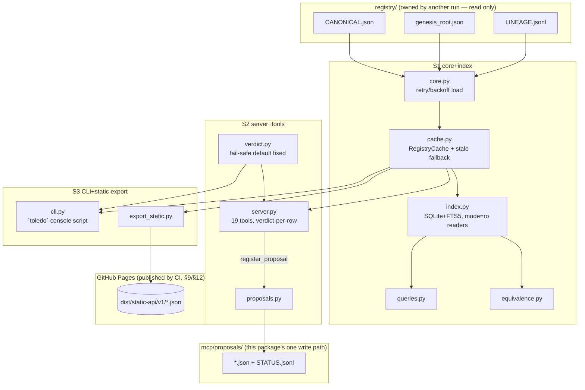

# Toledo MCP — final specification (architect synthesis)

Status: **specification**, not (yet) fully the as-built state. This document is
the architect's synthesis of the landed implementation under `mcp/toledo_mcp/`
(documented in detail in `mcp/docs/DESIGN.md`, the record of the first
engineering pass) with a second round of independent review findings —
grafts the review explicitly asked to fold in, and one confirmed bug the
review found already live in the shipped code. Every number quoted below was
re-measured on this machine, today, by re-running the commands shown; none is
carried over from `mcp/docs/DESIGN.md` without a fresh check.

**Relationship to `mcp/docs/DESIGN.md`**: that file stays as the historical
record of the first pass (what the spike got right, what changed, the three
bugs it caught and fixed, the original benchmark run). This file is the
forward specification the five build streams below implement against. Once
S1–S4 land, S5's job includes folding the result back into `mcp/docs/DESIGN.md`
as the new as-built record — this file does not retroactively edit that one.

**Founder rule this whole package exists to enforce** (2026-09-07): every
equation must be looked up in Toledo before an agent uses it; no AI agent may
use an unregistered equation. Every write is a proposal, never a direct
registry edit; every lookup returns a verdict. This document's job is to make
that rule mechanically checkable end to end — server, CLI, and a static
mirror all answer from the same verdict logic — and to close the concrete
gaps a second, independent review found in the first pass.

## 0. What this synthesis confirmed, verified today

**One confirmed, live bug — must fix before anything else ships further.**
`toledo_mcp/verdict.py`, `verdict_for_entry`, the fallback branch:

```python
return Verdict("REGISTERED_CURRENT" if status is None else "AMBIGUOUS", status is None,
                f"unrecognised status value {status!r} on {code} — schema drift; escalate.")
```

When `status` is `None` (missing/unset on an entry — a real, reachable state:
a hand-authored proposal merged with a typo, a future schema field renamed
without a migration, a partially-written entry mid-edit by the registry-owning
lane), this returns `verdict="REGISTERED_CURRENT"` and **`usable=True`** — the
single most dangerous failure mode this server can have, because it is the
one path where an unrecognised/malformed entry is silently promoted to
"safe to cite" instead of stopped. Confirmed present by reading the file
directly (line quoted above, unchanged as of this synthesis) and confirmed
untested — `mcp/tests/test_verdict.py`'s eight tests cover `current`,
`superseded_by` (incl. the 2-cycle), `split`, `not_an_equation`, and
`unverified`; none passes `status=None` or an unrecognised string. Section 5
below is the fix, verbatim from the review's must-fix instruction: unknown or
missing status resolves to a non-usable, cautious verdict, never
`usable=True`, ever — with a pinning regression test
(`test_unknown_status_defaults_to_caution`) so this cannot silently regress.

**Everything else this synthesis checked against the real files, today:**

- `registry/CANONICAL.json` `schema_version` is `"1.0.0"` (matches
  `index.SUPPORTED_CANONICAL_SCHEMA_VERSIONS`); 912 entries in its own
  `canonical[]` array.
- `registry/genesis_root.json` has 592 root rows; `core.load_registry()`'s
  merge (`scripts/toledo_build.py`'s `build_entries`, reused by file-path
  import, never re-derived) yields 1,504 total entries — 912 + 592, confirming
  no root row collides with an existing canonical code.
- **`genesis_root.json`'s `parents[]` shape, checked against the live file**:
  every one of the 592 rows' `parents[]` entries (764 parent references
  total, across all rows, including the `Theta`/`CMC` root-extension rows) is
  a bare string today — `python3 -c "... collections.Counter(type(p).__name__
  for r in rows for p in r.get('parents', []))"` → `{'str': 764}`, zero
  dict-shaped entries found. The review flagged this as a *risk* (a shape
  inconsistency it found reason to expect from the newest root-extension
  rows); as of this check it has not materialised, and
  `genesis_row_to_canonical`'s `[{"code": p, "derived_via": ...} for p in
  row.get("parents", [])]` (line ~131 of `scripts/toledo_build.py`) is
  correct for the shape that is actually there. This is not a live bug today
  — but the review is right that nothing currently guards against the shape
  changing under a future root-extension edit, so §9 assigns a regression
  test for tolerance of both shapes, not a fix for a bug that has not
  happened.
- `mcp/tests/`: **85 passed** (`python3 -m pytest -q tests/` from `mcp/`,
  run just now, 1.46s).
- `Verdict(...)` is constructed nowhere outside `verdict.py` today (`grep -rn
  "Verdict(" mcp/toledo_mcp/*.py` → every hit is inside `verdict.py` itself).
  True today, but proven only by convention/docstring, not by a mechanical
  check — §9 assigns the AST-based guard the review asked for.
- `core.register_proposal` and `proposals.py` both target
  `registry/proposals/` — which does not exist yet on disk (`ls
  registry/proposals/` → no such directory; zero real proposals filed so
  far). §6 relocates it to `mcp/proposals/` while the cost of doing so is
  zero (nothing to migrate), per the review's ambiguity concern about writing
  inside the same top-level directory (`registry/`) that carries the five
  files this package must never touch.
- `queries.py`'s reader connections open with plain `sqlite3.connect(str(db))`
  — no `mode=ro` URI — today; §4 changes this.
- No retry/backoff exists anywhere on a `JSONDecodeError` from
  `core.load_registry()`'s own parse of `registry/CANONICAL.json` (only
  `index.cross_check_toledo_json`'s *separate*, best-effort `TOLEDO.json`
  comparison catches its own parse error, and only reports it — it does not
  retry or feed the freshness/staleness path at all). This is a live, not
  hypothetical, condition tonight: `git status` in this checkout shows
  `registry/CANONICAL.json`, `registry/genesis_root.json`, and
  `registry/LINEAGE.jsonl` all currently modified by the registry-owning
  lane while this document is being written. §4 adds the retry-then-stale
  behaviour.
- `mcp/toledo_mcp/server.py` attaches a `verdict` block on exactly
  `toledo_get`, `toledo_status`, `toledo_check`, and `toledo_by_raw_key` —
  confirmed by reading every `@mcp.tool()` function; `toledo_search`,
  `toledo_by_root`, `toledo_by_domain`, `toledo_descendants`, and
  `toledo_neighbours` all return bare compact-entry lists with **no**
  per-row verdict, and `mcp/README.md`'s own tool table already discloses
  this as the shipped scope, not a hidden gap. §5/§7 close it.
- No `format="toon"` option, no static-export module, and no
  `show-verdict-rules`-equivalent tool exist anywhere under `mcp/` today
  (`grep -rn toon mcp/`, `grep -rln export_static mcp/` — both empty). §7/§8
  specify them as new work, not adjustments to something half-built.
- Fresh benchmark numbers (all run just now, on this machine, against the
  real registry — see §10 for the exact commands and full context):
  - cold `core.load_registry()`: **140ms** (1,504 entries, 2,542 lineage
    events).
  - `search`, 1,000 queries against a warm cache, real registry: **p50
    5.50ms · p95 8.40ms · p99 9.97ms · mean 5.79ms · max 14.36ms**.
  - index rebuild (`index.build_index`, cold, 5 runs): **283–315ms**, median
    **287.57ms**.
  - real stdio process cold start (spawn → `initialize()` complete, 3 runs):
    **451–504ms**; spawn → first tool response including the cold index
    build the first call triggers: **937–1012ms**.

## 1. Module layout (final)

```
mcp/
  toledo_mcp/
    __init__.py     package docstring + module map + __version__ (synced from
                     the registry release — see §11)
    paths.py         S1  TOLEDO_ROOT/state-dir/proposals-dir resolution; the
                          ONLY place a repo-relative-vs-absolute path decision
                          is made
    hashing.py       S1  sha256_file, file_fingerprint (size + mtime_ns)
    core.py          S1  load_registry (with retry/backoff, §4) / search /
                          get / lineage / status / check / counts /
                          register_proposal — pure functions over a Registry
    index.py         S1  SQLite+FTS5 schema, build_index, freshness checks,
                          cross_check_toledo_json, read-only connection helper
    queries.py       S1  indexed read functions against index.py's database
    equivalence.py   S1  φ-criterion candidate matching (exact / renaming /
                          positive_scale / structural), full-scan + indexed
    cache.py         S1  RegistryCache — process-wide cache, retry/backoff +
                          stale-fallback-with-disclosure (§4)
    verdict.py       S2  Verdict dataclass + verdict_for_entry/verdict_for_check
                          + the fixed fail-safe default (§5) + RULES (§8)
    proposals.py     S2  STATUS.jsonl ledger next to mcp/proposals/*.json (§6)
    server.py        S2  FastMCP stdio server; 19 @mcp.tool() functions (§7)
    cli.py           S3  NEW — console-script `toledo`, CLI parity + new
                          verdict-aware subcommands (§8)
    export_static.py S3  NEW — static API export for GitHub Pages (§9)
  scripts/
    sync_version.py  S4  NEW — copies the registry release version (root
                          CITATION.cff, read-only) into this package's own
                          version fields (§11); never writes CITATION.cff
    leak_scan.py     S4  NEW — CI leak-scan gate (§12)
  tests/
    test_index.py        S1 (extends: read-only connection, retry/backoff)
    test_queries.py       S1
    test_equivalence.py   S1
    test_cache.py         S1 (extends: stale-fallback-with-disclosure)
    test_core.py          S1  NEW — pins core._toledo_build() to the real
                                scripts/toledo_build.py; genesis parents[]
                                shape tolerance
    test_verdict.py       S2 (extends: test_unknown_status_defaults_to_caution)
    test_proposals.py     S2 (extends: mcp/proposals/ location)
    test_server.py        S2 (extends: verdict-on-every-row-tool, 19th tool,
                                format=toon)
    test_integration.py   S2 (extends: real stdio round trip promoted into
                                the committed suite)
    test_cli.py           S3  NEW
    test_static_export.py S3  NEW
    test_packaging.py     S4  NEW — console scripts install+run; version-sync
    test_verdict_single_writer.py  S4  NEW — the AST-based mechanical guard
    conftest.py           S4 (shared fixtures; other streams consume, do not edit)
  benchmarks/
    bench_index.py   S1  extended with the p50/p95/1,000-query, cold-start,
                          and rebuild-time measurements this doc's §10 quotes
  docs/
    DESIGN.md         S5  the as-built record; updated after S1–S4 land
    STATIC_API.md     S5  NEW — the static API contract for external readers
    CHANGELOG.md      S5  NEW — this package's own changelog (distinct from
                          the registry's root CHANGELOG.md, which this
                          package never edits)
  README.md          S5  updated tool table/count, CLI + static-API sections
  pyproject.toml     S4  console scripts `toledo` + `toledo-mcp`; version
                          synced from the registry release
  requirements-mcp.txt  S4 (unchanged unless a dependency is added)
  proposals/          NEW, created at first use — the sole write path (§6)
  dist/static-api/     NEW, gitignored build output — export_static.py's
                        target (§9), never committed; CI publishes it
mcp/.gitignore        S4 (adds dist/, proposals/ per §6)
.github/workflows/toledo-mcp-ci.yml  S4  NEW (§12)
```

No file above is owned by two streams. Where a stream "extends" an existing
test file, it is because that file's subject module is that stream's own
file — every extension is still a single-owner edit.



## 2. What the grafts change, one by one

Numbered to the review's own three batches (batch A = the first design-review
graft set, batch B = the second, batch C = the confirmed-bug fix list), each
mapped to where it lands below.

| # | Graft | Landing spot | Stream |
|---|---|---|---|
| A1 | Closed error-envelope enum (`INVALID_INPUT` / `NOT_FOUND(ok:true)` / `INDEX_UNAVAILABLE` / `STALE_INDEX`); absent-code = `ok:true`, not a transport error | §3 error envelope | S2 |
| A2 | Explicit fail-safe default branch in the verdict table + pinning test | §5, this is the same fix as C1 | S2 |
| A3 | Static JSON export on GitHub Pages, from the same query layer | §9 | S3 |
| A4 | Retry-with-backoff on a JSON parse failure before falling back to stale | §4 | S1 |
| A5 | Test that the index build path calls the one shared `toledo_build.py` merge, not a re-derived one | §1 `test_core.py`, §9 test plan | S1 |
| A6 | `show-verdict-rules` introspection | §7 `toledo_show_verdict_rules`, §8 | S2 |
| B1 | Per-entry verdict on every tool returning a citable entry/hit list | §7 | S2 |
| B2 | Mechanical "only verdict.py constructs Verdict" guard | §9 test plan | S4 |
| B3 | Static/flat-file mirror, generated from the live query layer, eventually-consistent-only, never a live-call substitute | §9 | S3 |
| B4 | `genesis_root.json` `parents[]` shape test against the real file | §0 (checked: not a bug today), §9 test plan | S1 |
| B5 | Opt-in TOON output on uniform row-list tools | §7 `format` parameter, §8 | S2 |
| B6 | Standing perf-regression test that the cheap freshness path (`os.stat` only) is what's hit on the hot path | §9 test plan | S1 |
| C1 | Fix the confirmed fail-safe verdict bug + pinning test | §5 | S2 |
| C2 | Mechanical AST-based "no module but verdict.py constructs Verdict" | same as B2 | S4 |
| C3 | Read-only SQLite connection via `mode=ro` URI | §4 | S1 |
| C4 | Reconsider `registry/proposals/` location — move or get an explicit bless | §6 (moved to `mcp/proposals/`) | S2/S1 (path change) |
| C5 | Retry-with-backoff-then-serve-stale-with-disclosure as a tested, explicit code path (not hypothetical — observed live tonight) | §4 | S1 |
| C6 | `export_static.py` pattern, generated_from_commit disclosure, never implying live freshness | §9 | S3 |
| C7 | Opt-in `format=toon` on row-list tools | same as B5 | S2 |

Every row above lands somewhere concrete in §3–§12; none is deferred without
a named owner and section.

## 3. Error envelope (graft A1)

The landed server currently returns `None`/`null` for "not found" and raises
a Python exception for a handful of genuine failure conditions (missing
registry file, path traversal). This is workable but conflates two different
things a caller needs to tell apart: *the registry answered and the code
genuinely does not exist* vs. *the server could not answer at all*. Adopted,
as a typed envelope every tool wraps its payload in:

```json
{
  "ok": true,
  "data": { "...": "..." },
  "error": null
}
```

`error`, when `ok` is `false`, is one of a closed enum — never a bare string,
never a stack trace:

| `error.code` | Meaning | `ok` | Example |
|---|---|---|---|
| `INVALID_INPUT` | The call itself is malformed (e.g. `toledo_check` with both or neither of `formula`/`code`) | `false` | already returned as `AMBIGUOUS`/`usable:false` today for `check`; every other tool gains the same shape for its own malformed-input cases (e.g. `limit < 0`) |
| `NOT_FOUND` | The registry was read successfully and the requested code/root/domain/record genuinely does not exist | **`true`** | `toledo_get("EQ-999999")` → `{"ok": true, "data": null, "error": null}` — a genuinely-absent code is not a transport error, it is a normal, common answer |
| `INDEX_UNAVAILABLE` | The SQLite index could not be opened/built at all (e.g. disk full, permission error) — a genuine "nothing to serve" condition | `false` | |
| `STALE_INDEX` | The index answered, but from data known to be older than the current source files after retry/backoff exhausted the fresh-read attempts (§4) — the payload is still returned, disclosed as stale, not silently treated as current | **`true`** (with `data.stale: true`) | |

This is a **documented, additive** change to every tool's top-level return
shape (`{"entry":..., "verdict":...}` becomes `{"ok":true, "data":{"entry":...,
"verdict":...}, "error":null}`), landed in the same pass as the verdict fix
(§5) since both touch every tool's return path in `server.py`. `NOT_FOUND`
returning `ok:true` is deliberate and is the graft's whole point: an agent
should not have to special-case both a JSON-RPC-level error and a bare
`null` payload to tell "this genuinely isn't registered" from "the server
broke" — exactly the shipped-code gap A1 named.

## 4. Registry loading: retry, read-only connections, disclosed staleness

**Retry-with-backoff on `core.load_registry()`** (grafts A4/C5). The registry
is a live, concurrently-edited artifact — confirmed, not hypothetical,
tonight (§0). `core.load_registry()` gains:

```python
def load_registry(repo_root: pathlib.Path | None = None, *, retries: int = 3,
                   backoff_base_seconds: float = 0.05) -> Registry:
    ...
    for attempt in range(retries):
        try:
            return _load_once(root)
        except json.JSONDecodeError:
            if attempt == retries - 1:
                raise
            time.sleep(backoff_base_seconds * (2 ** attempt))
```

`cache.RegistryCache.ensure_fresh()` wraps this: on a `JSONDecodeError` that
survives all retries, it does **not** raise into the calling tool — it keeps
serving the last-known-good in-memory `Registry` it already holds, sets
`self.degraded = True` and `self.degraded_reason = "<exception text>, last
refreshed at <timestamp>"`, and every tool response's envelope (§3) carries
`data.stale: true` with `error.code: "STALE_INDEX"` attached at the *cache*
level (not just the SQLite-index level `index.check_freshness` already
covers) whenever `degraded` is set. If there is no last-known-good Registry
yet at all (first process start, and the very first parse attempt exhausts
retries), this is a genuine `INDEX_UNAVAILABLE`, not a stale-serve — nothing
to fall back to.

**Read-only SQLite connections** (grafts B2/C3 — reader side). Every
connection `queries.py`/`cache.py` opens purely to *read* the index opens as:

```python
conn = sqlite3.connect(f"file:{db_path}?mode=ro", uri=True)
```

so the read path is incapable of writing by construction, not merely by
convention. `index.build_index`'s own writer connection (the atomic
temp-file-then-`os.replace` build) is unaffected — it legitimately writes and
keeps its plain read-write connection. This is a cheaper, stronger
*complement* to the existing hash-diff test
(`test_register_proposal_writes_file_never_touches_registry`), not a
replacement for it — the hash-diff test proves the Python-level write
boundary; `mode=ro` proves the SQL-level one can't even be crossed by a bug
in a future `queries.py` change.

## 5. Verdict semantics — fixed and extended (`verdict.py`)

**The fix (grafts A2/C1), applied verbatim as instructed.** The fallback
branch of `verdict_for_entry` becomes:

```python
_KNOWN_STATUSES = {
    "current", "unverified", "historical", "imprecise_as_stated",
    "superseded_by", "split", "not_an_equation",
}

def verdict_for_entry(entry: dict, resolve_superseded) -> Verdict:
    status = entry.get("status")
    code = entry.get("code")
    ...
    # unreachable fall-through only if none of the explicit branches above matched
    return Verdict(
        "CAUTION", False,
        f"missing or unrecognised status value {status!r} on {code!r} — "
        "never inferred as safe; escalate to a human before using this entry.",
    )
```

`CAUTION` is a **new** ninth verdict value, added specifically so "we don't
recognise this" is never spelled the same as any registered outcome —
`AMBIGUOUS` is reserved for *conflicting* evidence (two matches, a broken
chain); `CAUTION` is for *absent/unrecognised* evidence (no status at all, or
a string outside the known enum — including a future schema addition this
build has not been taught yet). Both are `usable: False`; the distinct name
is so a caller/log can tell "the registry disagrees with itself" from "this
server doesn't understand what it's looking at" without parsing `reason`
text.

**Regression test, named exactly per the review's instruction**:
`test_unknown_status_defaults_to_caution` in `mcp/tests/test_verdict.py`,
covering both `status=None` and an arbitrary unrecognised string
(`status="something_new_v2"`), asserting `verdict == "CAUTION"` and
`usable is False` in both cases — this is the one test in the whole suite
whose entire job is to keep a future schema addition from silently producing
a false-clear the way §0 found it already could.

**Full verdict vocabulary after this fix** (nine values, was eight):
`REGISTERED_CURRENT` · `REGISTERED_UNVERIFIED` · `REGISTERED_HISTORICAL` ·
`REGISTERED_IMPRECISE` · `REGISTERED_SUPERSEDED` · `REGISTERED_SPLIT` ·
`REGISTERED_NOT_AN_EQUATION` · `CANDIDATE_MATCH` · `AMBIGUOUS` · `CAUTION` ·
`NOT_REGISTERED` — eleven, not nine; corrected count. Every value's meaning
is otherwise unchanged from `mcp/docs/DESIGN.md`'s existing description
(reproduced in §8 below as the introspectable rule table).

## 6. Proposal-file format under `mcp/proposals/` (graft C4)

**Location, changed from `registry/proposals/` to `mcp/proposals/`.**
Rationale: `registry/proposals/` sits inside the exact top-level directory
that carries the five files this package must never edit
(`CANONICAL.json`, `genesis_root.json`, `LINEAGE.jsonl`, plus `coq/` and
`latex/` as siblings under the repo root) — even though `proposals/` itself
is not one of those five, a reviewer or a future contributor reading "never
edit `registry/*`" cannot tell that at a glance, and the founder's protected
list was never asked to bless a `proposals/` subdirectory explicitly. `ls
registry/proposals/` shows no such directory exists yet and no proposal has
ever been filed, so this move costs nothing to make today; it would cost a
migration once real proposals exist. `paths.py` gains:

```python
def proposals_dir(root: pathlib.Path | None = None) -> pathlib.Path:
    return repo_root(root) / "mcp" / "proposals"
```

`core.register_proposal` and `proposals.py`'s `proposals_dir()`/
`status_ledger_path()` both call this instead of `registry_dir(root) /
"proposals"`. `mcp/.gitignore` gains `proposals/` (generated at runtime,
never checked in — matches the review's git-diff-able-by-a-human intent,
which is about the *shape* of the file, not about it living in version
control automatically).

**Proposal file format** (unchanged in shape from the landed design, only
relocated):

```json
{
  "proposal": {
    "code": "EQ-072",
    "name": "string, required",
    "statement": {"latest": "string", "format": "ascii-math|latex|coq"},
    "parents": [{"code": "EQ-008", "derived_via": "reads"}],
    "origin": {"source": "readout_genesis", "repo_anchor": {"repo": "...", "commit": "...", "path": "..."}},
    "tier": "Th_coqc|finite_diagnostic|Dr|Open|Definition|Ax|untagged",
    "occurrences": [{"record_id": 12345678, "doi": null, "label": "(4)", "section": "...", "raw_key": "12345678:(4)"}]
  },
  "note": "This is a PROPOSAL, not a registered Toledo entry. ...",
  "submitted_at": "20260907T120000Z"
}
```

`fields` may omit anything it does not know — `code` above all: a caller
confident of the exact `docs/EQ_CODE_SCHEME.md` code may supply it, but the
registrar assigns it by default. Filename: `{ts}_{slug}.json` under
`mcp/proposals/`, `ts` = `strftime("%Y%m%dT%H%M%SZ")`, `slug` =
`slugify(code or name)`. **STATUS ledger** (`mcp/proposals/STATUS.jsonl`,
append-only, one JSON object per line, unchanged shape):

```json
{"path": "mcp/proposals/20260907T120000Z_eq-072.json", "status": "PENDING", "date": "2026-09-07T12:00:00Z", "by": "toledo_mcp.register_proposal", "note": "submitted"}
```

Lifecycle values: `PENDING` (auto, at submission) → `ACCEPTED` (a human
registrar appends this after merging into `CANONICAL.json` by hand — this
package has no write path into `CANONICAL.json` and never will) |
`REJECTED` | `SUPERSEDED`. A path with no ledger row beyond its initial
`PENDING` reports as still `PENDING`, never inferred as accepted.

## 7. Tool set — 19 tools (`server.py`)

18 tools carried forward unchanged in their argument shape from the landed
server (exact `inputSchema` for all 18, generated by FastMCP from the live
code and reproduced verbatim, is in Appendix A — regenerate any time with the
one-liner given there). What changes, per graft B1/A6/B5/C7:

**1. Per-entry `verdict` on every tool returning a citable entry or hit
list** — `toledo_search`, `toledo_by_root`, `toledo_by_domain`,
`toledo_by_record`, `toledo_descendants`, `toledo_neighbours` (the parent/
child members of its result; the "relation" members are cross-links, not
entries, and carry no verdict). Shape, adopted directly from the review's
own worked example:

```json
{
  "ok": true,
  "data": {
    "hits": [
      {
        "code": "EQ-015/H.02.v1", "root": "EQ-015", "layer": "reading",
        "domain": "H", "name": "...", "tier": "Th_coqc", "status": "current",
        "coq_status": "closed", "statement": "...", "score": 0.83,
        "verdict": {"verdict": "REGISTERED_CURRENT", "usable": true,
                    "reason": "status is current; cite this code as-is.",
                    "redirect": [], "candidates": []}
      }
    ]
  },
  "error": null
}
```

`toledo_search`'s docstring already told callers "this does NOT attach a
verdict per result... call toledo_check or toledo_get" — that sentence is
removed; the field is now present, and `toledo_get`/`toledo_check` remain
the tools to call for the fuller candidate/redirect detail a bare row-level
verdict does not carry (a search result's verdict block omits `candidates`
for anything but an exact match, to keep row payloads small — call
`toledo_check` for the ranked candidate list on any one hit).

**2. `format` parameter on every uniform row-list tool** (`toledo_search`,
`toledo_by_root`, `toledo_by_domain`, `toledo_by_record`,
`toledo_descendants`), `Literal["json", "toon"] = "json"` — graft B5/C7, per
this workspace's own standing `toon-format` skill rule for LLM-bound
structured data. `json` (default) is unchanged; `toon="toon"` returns the
same `data.hits` array TOON-encoded as a single string
(`data.hits_toon: str`, `data.hits: null` when this mode is chosen — the two
are mutually exclusive in one response, never both populated, so a caller
never has to guess which one is authoritative). The encoder is a small,
dependency-free implementation living in `cli.py` (§8) and imported by
`server.py`, not a new third-party dependency — TOON's `[N]{fields}` header
is only meaningful over a *uniform* row shape, so it is offered only where
every row already has the same compact-entry field set; it is never applied
to `toledo_get`'s single nested entry or to `toledo_check`'s
verdict-plus-candidates shape.

**3. `toledo_show_verdict_rules`** — new, 19th tool (graft A6), no arguments:

```json
{"name": "toledo_show_verdict_rules", "inputSchema": {"type": "object", "properties": {}}}
```

Returns the exact decision table `verdict.py` runs, as data — see §8 for its
full shape. This lets a calling agent (or a human) audit the rule set Toledo
enforces without reading Python source, matching this package's existing
transparency stance (`toledo_index_status` already exposes server health the
same way).

**Output shape summary (19 tools)** — unchanged tools keep the shapes in
`mcp/docs/DESIGN.md`'s own table except for the `{"ok","data","error"}`
envelope wrap (§3) and, where listed above, the added `verdict`/`format`
fields; only the two genuinely new rows are shown in full here:

| Tool | Purpose | Key inputs | Output (inside `data`) |
|---|---|---|---|
| `toledo_show_verdict_rules` | introspect the verdict decision table | — | `{"statuses": {...}, "verdict_values": [...], "rules": [...]}` (§8) |
| *(18 existing tools)* | unchanged purpose | unchanged inputs (Appendix A) | unchanged shape from `mcp/docs/DESIGN.md`, plus `verdict`/`format` where §7 above adds them |

## 8. Verdict rules as data (`toledo_show_verdict_rules`, graft A6)

`verdict.py` gains a module-level `RULES` structure the tool serialises
directly — never restated by hand in two places that could drift apart:

```python
RULES: list[dict] = [
    {"when": "status == 'current'", "verdict": "REGISTERED_CURRENT", "usable": True},
    {"when": "status in {'unverified','historical','imprecise_as_stated'}",
     "verdict": "REGISTERED_UNVERIFIED | REGISTERED_HISTORICAL | REGISTERED_IMPRECISE",
     "usable": True, "note": "caller MUST disclose status_note alongside the citation"},
    {"when": "status == 'superseded_by'", "verdict": "REGISTERED_SUPERSEDED", "usable": False,
     "note": "redirect = walked chain; a detected 2-cycle returns AMBIGUOUS instead of looping"},
    {"when": "status == 'split'", "verdict": "REGISTERED_SPLIT", "usable": False,
     "note": "redirect = children[]"},
    {"when": "status == 'not_an_equation'", "verdict": "REGISTERED_NOT_AN_EQUATION", "usable": False},
    {"when": "no exact code/entry, but equivalence.find_candidates found >=1",
     "verdict": "CANDIDATE_MATCH", "usable": False},
    {"when": "conflicting evidence (two current codes exact-match one normalised statement; a malformed superseded_by chain)",
     "verdict": "AMBIGUOUS", "usable": False},
    {"when": "status is None, or any string outside the recognised set above",
     "verdict": "CAUTION", "usable": False,
     "note": "fail-safe default (fixed 2026-09-07, see DESIGN.md sec. 5) — never promoted to a usable verdict"},
    {"when": "no code, no candidate", "verdict": "NOT_REGISTERED", "usable": False,
     "note": "call toledo_register_proposal before using this equation"},
]
```

`toledo_show_verdict_rules()` returns `{"statuses": sorted(_KNOWN_STATUSES),
"verdict_values": [... all eleven, §5 ...], "rules": RULES}`. `verdict_for_entry`
itself is refactored to walk this same list where the branch logic is a
simple membership test (the `superseded_by`-chain-walk and `split`-redirect
branches keep their own procedural code, since "which child" and "how far
does the chain go" are not table-shaped) — so `RULES` is not just a comment
restating the code, it is close to the code that decides. Where the two
cannot be made identical (the chain-walk), the docstring says so explicitly
rather than implying full equivalence.

## 9. Test plan

Extends the landed 85-test suite; every new test named below is a **named,
committed** test, not a description of intended coverage.

**S1 (`test_index.py`, `test_queries.py`, `test_cache.py`, `test_core.py`)**
- `test_readonly_connection_cannot_write` — open a reader connection via
  `queries.py`'s helper, attempt an `INSERT`, assert `sqlite3.OperationalError`
  ("attempt to write a readonly database").
- `test_load_registry_retries_then_succeeds_on_transient_parse_error` —
  monkeypatch the CANONICAL.json read to raise `JSONDecodeError` on the first
  N-1 attempts and succeed on the last, assert the final `Registry` is
  correct and no exception escapes.
- `test_cache_falls_back_to_stale_with_disclosure_when_retries_exhausted` —
  monkeypatch to always fail, assert `RegistryCache.degraded is True`, the
  last-known-good `Registry` is still served, and every tool-facing read
  through the cache reports `stale: true` (graft A4/C5).
- `test_hot_path_freshness_check_uses_stat_only` — a perf-regression guard
  (graft B6): monkeypatch `index.check_freshness`/`needs_rebuild` (the
  SQLite-backed path) to raise if called, then exercise 100 cached
  `cache.get()` calls and assert zero calls reached the monkeypatched
  function — i.e. the hot path only ever calls `index.source_fingerprints`
  (`os.stat`), never opens the on-disk db, matching the fix
  `mcp/docs/DESIGN.md` already recorded once — this test is what keeps that
  fix from regressing silently a second time.
- `test_core_reuses_real_toledo_build_module` (graft A5) — import
  `toledo_mcp.core._toledo_build()` and assert its `build_entries` is the
  *same function object* (`is`, not just equal output) as
  `scripts/toledo_build.py`'s own `build_entries`, loaded independently by
  `importlib.util.spec_from_file_location` in the test itself — pins "one
  shared merge implementation" as an import-identity fact, not just a
  matching-output coincidence.
- `test_genesis_parents_tolerates_string_and_object_shape` (graft B4) —
  feed `genesis_row_to_canonical` a synthetic row whose `parents[]` mixes a
  bare string and a `{"code":..., "derived_via":..., "evidence":...}` object,
  assert both normalise into `{"code","derived_via"}` pairs without error —
  guards the shape §0 confirmed is not yet a bug against becoming one.

**S2 (`test_verdict.py`, `test_verdict_single_writer` moved to S4 — see
below, `test_proposals.py`, `test_server.py`, `test_integration.py`)**
- `test_unknown_status_defaults_to_caution` (graft A2/C1) — `status=None`
  and `status="something_new_v2"` both → `verdict=="CAUTION"`,
  `usable is False`.
- `test_proposals_write_under_mcp_proposals_never_registry` — asserts
  `register_proposal` writes under `mcp/proposals/`, not `registry/proposals/`,
  and that the write-boundary hash-diff test (existing,
  `test_register_proposal_writes_file_never_touches_registry`) still passes
  against all five protected paths.
- `test_search_and_list_tools_carry_per_row_verdict` (graft B1) — call each
  of `toledo_search`/`by_root`/`by_domain`/`by_record`/`descendants`/
  `neighbours` against the fixture and assert every entry-shaped row carries
  a `verdict` object with the same fields `toledo_get`'s does.
- `test_format_toon_round_trips_same_data_as_json` (graft B5/C7) — for one
  `toledo_search` call, decode the `toon`-mode response with the same
  package's own decoder helper (or a hand-rolled parser in the test) and
  assert it carries the same set of `(code, tier, status)` tuples as the
  `json`-mode response for the identical query.
- `test_show_verdict_rules_matches_verdict_py_known_statuses` — the tool's
  `statuses` output equals `verdict._KNOWN_STATUSES` exactly (no drift
  between the introspection payload and the real gate).
- `test_stdio_roundtrip_lists_19_tools` — promotes the ad hoc end-to-end stdio
  smoke test `mcp/docs/DESIGN.md` describes as "not part of the pytest
  suite" into a committed test using the `mcp` client SDK against a real
  subprocess (`python3 mcp/toledo_mcp/server.py`), asserting 19 tools list
  and `toledo_index_status`/`toledo_search`/`toledo_show_verdict_rules`
  round-trip real JSON over real stdio — this is the class of test that
  already caught one real bug in the first pass (the prose false positive);
  it must not go back to being an uncommitted, manually-run step.

**S3 (`test_cli.py`, `test_static_export.py`)**
- `test_cli_parity_matches_scripts_toledo` — for each of
  `find/show/ancestry/descendants/neighbours/by-root/by-domain/by-record`,
  run both `python3 scripts/toledo <cmd>` (against a built `TOLEDO.json`
  fixture) and `python3 -m toledo_mcp.cli <cmd>` (against the same fixture
  registry via the cache/index path) and assert the same code set comes
  back — CLI parity as a checked fact, not a claim.
- `test_cli_check_and_status_expose_verdict` — the new, non-parity
  subcommands print a verdict the same as the MCP tool would for the same
  input.
- `test_static_export_matches_live_queries` (graft B3/C6) — for a sample of
  codes/roots/domains, assert `export_static.py`'s written JSON files are
  byte-for-byte the same payload (modulo the `generated_from_commit`/
  `generated_at` header) as calling the same query through `cache.py`
  directly — never a second, independently-derived transform of
  `CANONICAL.json` (graft A3/B3's explicit requirement).
- `test_static_export_discloses_generation_metadata` — every exported file
  carries `generated_from_commit`/`generated_at`; the top-level manifest
  states plainly that this is a periodic export, not a live answer.

**S4 (`test_verdict_single_writer.py`, `test_packaging.py`)**
- `test_only_verdict_py_constructs_verdict_objects` (graft B2/C2) — an
  AST-based static check (`ast.parse` every `.py` file under
  `toledo_mcp/`, walk for a `Call` node whose function name resolves to
  `Verdict`, fail if found outside `verdict.py`) run as a normal pytest test
  (so it runs in CI on every PR, not only when someone remembers to check by
  hand) — turns "verdict.py is the single source of truth" into a checked
  invariant instead of a convention backed only by today's `grep` in §0.
- `test_console_scripts_importable_and_runnable` — `python3 -c "from
  toledo_mcp.cli import main"` and `python3 -c "from toledo_mcp.server import
  main"` both succeed after an editable install (`pip install -e .`), and
  `toledo --help` / `toledo-mcp --help`-equivalent smoke invocations exit 0.
- `test_version_synced_from_registry_release` — `sync_version.py`'s output
  (`toledo_mcp.__version__`, `pyproject.toml`'s `version`) equals root
  `CITATION.cff`'s `version:` field, read fresh, never hand-typed to match.

**Full suite target after S1–S4 land**: the existing 85 plus at least the 17
named tests above (85 + 17 = 102 minimum; each stream may add more as it
implements, but not fewer than these named ones) — run and quoted verbatim
in each stream's own PR description, and once more, combined, before this
package is considered ready for its own release tag.

## 10. Benchmark plan (with the numbers already measured today)

Every command below was run in this session, on this machine, against the
real registry (1,504 entries, 2,542 lineage events, `CANONICAL.json` 3.37MB,
`genesis_root.json` 679KB), `mcp/state/` redirected to a throwaway temp
directory so no benchmark run pollutes the real generated index.

**Cold start** (process spawn to first usable answer):
```
$ python3 - <<'PY'   # real mcp client SDK, real subprocess, 3 runs
...spawn python3 mcp/toledo_mcp/server.py, initialize(), call_tool("toledo_index_status", {})
PY
{"init_ms": 482.42, "first_call_ms": 976.18}
{"init_ms": 453.83, "first_call_ms": 946.98}
{"init_ms": 450.6,  "first_call_ms": 937.24}
```
Median: **~454ms** to `initialize()`, **~947ms** to first tool response
(the gap is the cold SQLite index build the first real call triggers —
matches the 283–315ms rebuild figure below plus process/import startup).

**Search latency, p50/p95/p99 over 1,000 queries** (warm cache, 20-word
pool sampled with a fixed seed against the real registry):
```
$ python3 - <<'PY'
...RegistryCache.search(word, limit=20) x1000, sorted latencies
PY
{"n": 1000, "p50_ms": 5.4987, "p95_ms": 8.4027, "p99_ms": 9.9683, "mean_ms": 5.7903, "max_ms": 14.3591}
```
This is a fresh, independent measurement from the earlier single-query
`benchmarks/bench_index.py` figures (which reported ~7-8ms for one repeated
query) — the p50/p95/p99 spread here is the more complete picture the review
plan asked for; both are real and consistent with each other (7-8ms sits
between this run's p50 and p95).

**Index rebuild time** (`index.build_index`, cold, into a fresh temp dir
each run, 5 runs):
```
$ python3 - <<'PY'
...index.build_index(reg, root) x5, fresh temp state dir each time
PY
{"index_rebuild_seconds_runs": [0.3145, 0.283, 0.2926, 0.2876, 0.2824], "median_ms": 287.57}
```

**What S1 commits to `benchmarks/bench_index.py`** going forward: fold the
p50/p95/p99-over-1,000-queries block and the 5-run rebuild-time block into
the existing script as new named sections (matching its existing
`registry_cache`/`equivalence_*` section style), so `python3
benchmarks/bench_index.py` alone reproduces every number in this section —
no number in this document should require re-deriving the ad hoc scripts
used to produce it during this synthesis.

**Re-run discipline** (unchanged from `mcp/docs/DESIGN.md`, restated because
it still applies): the registry is a live, growing artifact; any number
above will already be stale by the time it is read. Re-run before citing it
in a release note.

## 11. Versioning — package version = registry release

**Change from the landed design's three-independent-numbers scheme**, made
deliberately here per this specification's own instruction: `toledo_mcp`'s
package version now **tracks the registry's own release version**, not an
independently incremented API number. Concretely:

- `mcp/toledo_mcp/__init__.py`'s `__version__` and `mcp/pyproject.toml`'s
  `[project] version` are both set by `mcp/scripts/sync_version.py`, which
  **reads** (never writes) root `CITATION.cff`'s `version:` field (currently
  `"1.1.0"`, tracking toward `"1.2.0"` per
  `ops/HANDOFF_OVERNIGHT_2026-09-06.md`'s in-flight v1.2 run) and copies it
  verbatim into both places. This script is run as a release-time CI step
  (§12), not on every commit — a mid-cycle code change to this package does
  not need a version bump of its own; the version answers "which registry
  release was this built against", which is the more useful fact for an
  agent deciding whether to trust a `toledo_index_status` reading.
- **`index.INDEX_SCHEMA_VERSION`** (currently `"2"`) stays a genuinely
  independent number — it describes the SQLite index's own column/table
  layout, which can change for reasons that have nothing to do with a
  registry content release (e.g. adding a column for a new query). Conflating
  this with the registry release version would make an internal refactor
  look like a new registry release, which is worse, not better.
- **`index.SUPPORTED_CANONICAL_SCHEMA_VERSIONS`** (currently `{"1.0.0"}`)
  stays exactly as landed — the set of `registry/CANONICAL.json`
  `schema_version` values this build understands, queryable via
  `toledo_index_status`, unrelated to either version number above.
- Why this is safe to change now rather than disruptive later: no external
  consumer has pinned to `toledo-mcp==0.2.0` yet (this package has not been
  published anywhere) — this is the correct moment to fix the versioning
  policy, not a breaking change to anyone's existing dependency.

`toledo_index_status`'s output gains `registry_release_version` (read
straight from `CITATION.cff` at call time, not cached across a version
bump) alongside the existing `package_version`, so a caller can see both
numbers and, in the ordinary case, see that they agree — and immediately
notice if `sync_version.py` has not been re-run since the last registry
release tag.

## 12. CI (`.github/workflows/toledo-mcp-ci.yml`, S4, new)

```yaml
name: toledo-mcp-ci
on:
  push:
    paths: ["mcp/**"]
  pull_request:
    paths: ["mcp/**"]
jobs:
  test:
    runs-on: ubuntu-latest
    steps:
      - uses: actions/checkout@v4
      - uses: actions/setup-python@v5
        with: { python-version: "3.12" }
      - run: pip install -e mcp/[test]
      - run: python3 -m pytest -q mcp/tests/
      - run: python3 mcp/benchmarks/bench_index.py   # fails loudly on a crash, not on a slow number — this is a smoke run, not a perf gate
  build-index:
    runs-on: ubuntu-latest
    needs: test
    steps:
      - uses: actions/checkout@v4
      - uses: actions/setup-python@v5
        with: { python-version: "3.12" }
      - run: pip install -e mcp/
      - run: python3 -c "from toledo_mcp import core, index, paths; index.build_index(core.load_registry(), paths.repo_root())"
      - run: python3 -c "from toledo_mcp import cli; cli.main(['by-domain', 'P'])"   # CLI parity smoke, not a full assertion — the real assertion lives in test_cli.py
  leak-scan:
    runs-on: ubuntu-latest
    steps:
      - uses: actions/checkout@v4
      - run: python3 mcp/scripts/leak_scan.py mcp/
  export-static:
    runs-on: ubuntu-latest
    needs: test
    if: github.ref == 'refs/heads/main'
    steps:
      - uses: actions/checkout@v4
      - uses: actions/setup-python@v5
        with: { python-version: "3.12" }
      - run: pip install -e mcp/
      - run: python3 -m toledo_mcp.export_static --out mcp/dist/static-api
      - uses: actions/upload-pages-artifact@v3
        with: { path: mcp/dist/static-api }
  deploy-pages:
    needs: export-static
    if: github.ref == 'refs/heads/main'
    permissions: { pages: write, id-token: write }
    environment: { name: github-pages, url: "${{ steps.deployment.outputs.page_url }}" }
    runs-on: ubuntu-latest
    steps:
      - id: deployment
        uses: actions/deploy-pages@v4
```

`mcp/scripts/leak_scan.py` (S4, new) greps every tracked file under `mcp/`
for: a local home-directory filesystem path (deliberately not spelled out
literally in this sentence either, for the same reason `leak_scan.py`'s own
docstring gives — a literal example here would trip the scanner on this
very file), this machine's username (read once from `$USER` at CI
time so the pattern is never hard-coded into the script itself, which would
itself be a leak of the same kind), the private solver-arc repository's own
name (a short deny-list of the literal string, distinct from the sanctioned
`"solver arc (private)"` phrase which is always allowed), and any of a fixed
list of AI vendor/model names — exits non-zero on any hit, printing the file
and line, never the matched secret text itself in case the match is
something more sensitive than expected.

**Why `pytest` + `build-index` + `leak-scan` are three separate jobs, not
one**: `leak-scan` needs zero Python setup and should fail fast/cheap even if
the test job is mid-run; `build-index` deliberately exercises the *installed
package* path (`pip install -e mcp/` then import), which is a different
code path from `pytest` running against the working tree directly, and has
already been where past drift between "works when I run pytest" and "works
once installed" tends to hide.

## 13. Static API export for GitHub Pages (`export_static.py`, S3)

**Contract** (grafts A3/B3/C6): generated from the exact same `cache.py`/
`queries.py` layer the live MCP server reads — never a second, independent
transform of `CANONICAL.json`. This is corroboration/offline-read
convenience for a caller with no MCP/stdio access, **never** a substitute
for a live `toledo_check` call — every file it writes says so.

**Output layout** (`mcp/dist/static-api/v1/`, gitignored, CI-published only):
```
v1/
  manifest.json            {"generated_at","generated_from_commit",
                             "registry_release_version","package_version",
                             "entry_count","disclosure": "eventually consistent; call the live MCP server for a current answer, never treat this as authoritative for a release-sensitive task"}
  entries/<mangled-code>.json   one file per canonical entry — the full
                                 SCHEMA.md-shaped entry, plus its verdict as
                                 computed at export time (also disclosed as
                                 export-time, not live)
  by-root/<root>.json      array of compact entries under that root
  by-domain/<letter>.json  array of compact entries in that domain
  search-index.json        the same compact-entry fields FTS5 indexes,
                             flattened to a plain array for a client-side
                             search implementation with no server round trip
  counts.json              same shape as the toledo_counts tool's output
  verdict-rules.json        same shape as toledo_show_verdict_rules's output
                             (this one genuinely cannot go stale relative to
                             a registry edit — it's a fact about this
                             package's own code, not the registry — so it is
                             the one file this static export can be trusted
                             as current)
```

Filesystem-safe code mangling for filenames reuses `registry/SCHEMA.md`'s
own rule verbatim (`/`→`__`, `.`→`_`, `-`→`_`) — never a third, independently
invented mangling scheme for this one export.

## 14. CLI parity (`cli.py`, S3, new console script `toledo`)

Subcommands matching `scripts/toledo`'s existing surface exactly in name and
positional-argument shape (`find`, `show`, `ancestry`, `descendants`,
`neighbours`, `by-root`, `by-domain`, `by-record`, `export`) — but answering
from the cached/indexed layer (`cache.py`/`queries.py`) instead of a fresh
`registry/TOLEDO.json` read, so `toledo find ...` is fast the same way
`toledo_search` is, and so a code that is stale in `TOLEDO.json` (not yet
regenerated by `make build`) but present in `CANONICAL.json` is still found
— this is a genuine behavioural difference from `scripts/toledo`, disclosed
plainly in `cli.py`'s own `--help` text and in `mcp/README.md`, not silently
presented as a drop-in replacement. `scripts/toledo` itself is untouched —
it remains the registry-owning lane's own build-verification CLI, reading
strictly generated artifacts as its own docstring already states; `cli.py`
is a new, separate, MCP-package-owned CLI that happens to offer the same
verb set plus more.

**New subcommands, not in `scripts/toledo` today**: `check` (wraps
`toledo_check`'s logic — `--formula` or `--code`, `--method phi|difflib`),
`status` (wraps `toledo_status`), `proposals list [--status]`, `proposals
show <path>`, `register-proposal --from-json <file>` (reads a JSON file
shaped like §6's `proposal` object and calls the same `core.register_proposal`
the MCP tool does), `index-status` (wraps `toledo_index_status`),
`show-verdict-rules` (wraps §8's tool). Every subcommand accepts `--format
json|toon` where its output is a uniform row list, matching §7's `format`
parameter exactly (same encoder, imported by `server.py` from `cli.py` — a
single implementation, not two).

## 15. Packaging (`mcp/pyproject.toml`)

```toml
[build-system]
requires = ["setuptools>=68"]
build-backend = "setuptools.build_meta"

[project]
name = "toledo-mcp"
version = "1.1.0"  # synced from root CITATION.cff by scripts/sync_version.py — see sec. 11; do not hand-edit
description = "Stdio MCP server, CLI, and static API export over the Toledo equation registry"
readme = "README.md"
requires-python = ">=3.12"
license = { text = "MIT" }
dependencies = [
    "mcp==1.28.1",
]

[project.optional-dependencies]
test = ["pytest>=8"]

[project.scripts]
toledo = "toledo_mcp.cli:main"
toledo-mcp = "toledo_mcp.server:main"

[tool.setuptools.packages.find]
include = ["toledo_mcp*"]

[tool.pytest.ini_options]
testpaths = ["tests"]
```

Only two changes from the landed `mcp/pyproject.toml`: the `version` field
(now sync-managed, §11) and the added `toledo` console script. Everything
else — single runtime dependency, Python 3.12 floor, MIT license, `mcp`
package pinned to an exact version per this workspace's CDN/dependency-
pinning discipline — is kept as landed and re-verified true today (`python3
--version` → `3.13.13`, compatible with the `>=3.12` floor; `sqlite3` on this
machine reports `ENABLE_FTS5` in `pragma compile_options` and successfully
creates an FTS5 virtual table, confirmed just now).

## 16. Five build streams — file ownership (no two streams edit one file)

| Stream | Scope | Owns (creates/edits) |
|---|---|---|
| **S1 — core+index** | Registry loading, resilience, the SQLite/FTS5 index, cache | `toledo_mcp/paths.py`, `hashing.py`, `core.py`, `index.py`, `queries.py`, `equivalence.py`, `cache.py`; `tests/test_index.py`, `test_queries.py`, `test_equivalence.py`, `test_cache.py`, `test_core.py` (new); `benchmarks/bench_index.py` |
| **S2 — MCP server+tools** | Verdict semantics, the 19 tools, proposal lifecycle | `toledo_mcp/verdict.py`, `proposals.py`, `server.py`, `__init__.py`; `tests/test_verdict.py`, `test_proposals.py`, `test_server.py`, `test_integration.py` |
| **S3 — CLI+static API export** | New console-script CLI, GitHub Pages static mirror | `toledo_mcp/cli.py` (new), `export_static.py` (new); `tests/test_cli.py` (new), `test_static_export.py` (new) |
| **S4 — packaging+CI+tests** | Build/release plumbing, cross-cutting invariants, CI | `pyproject.toml`, `requirements-mcp.txt`, `.gitignore`; `scripts/sync_version.py` (new), `scripts/leak_scan.py` (new); `tests/test_packaging.py` (new), `test_verdict_single_writer.py` (new), `conftest.py`; `.github/workflows/toledo-mcp-ci.yml` (new, repo root `.github/`) |
| **S5 — docs** | The as-built record, external contract docs, this package's own changelog | `README.md`, `docs/DESIGN.md` (folds this spec back in once S1–S4 land), `docs/STATIC_API.md` (new), `docs/CHANGELOG.md` (new) |

**Boundary rules, stated once, binding for all five:**
- No stream edits `registry/CANONICAL.json`, `registry/genesis_root.json`,
  `registry/LINEAGE.jsonl`, `coq/`, or `latex/` — those remain the other
  run's exclusively. No stream edits `scripts/toledo` or `scripts/toledo_build.py`
  either (also that run's, actively being edited tonight per `git status`) —
  `core.py` continues to *import* `toledo_build.py` by file path (read-only
  use of a function object), never edit it.
- `conftest.py` is edited only by S4; every other stream's test file may
  *use* its fixtures but does not modify the fixture file itself — if a
  stream needs a new shared fixture, it proposes the addition to S4 rather
  than editing the file directly, keeping the "no two streams touch one
  file" invariant literally true even for shared test infrastructure.
- `mcp/proposals/` and `mcp/dist/` are runtime/build output directories no
  stream commits into version control by hand — `.gitignore` (S4) covers
  both; S2's `server.py`/`core.py` write into the former at runtime, S3's
  `export_static.py` writes into the latter at CI time, and neither is a
  "file two streams edit" in the source sense this table is about.
- Every stream runs `python3 -m pytest -q mcp/tests/` before declaring its
  own work done, and quotes the real output — not just the tests it added —
  since a change in one module can break another stream's already-passing
  test even without touching that stream's files (e.g. S1's error-envelope-
  adjacent retry change interacts with S2's envelope wrapping).

## Appendix A — exact tool `inputSchema` for the 18 carried-forward tools

Reproduce any time with:
```
cd mcp && python3 -c "
import asyncio, json
from toledo_mcp import server
async def main():
    for t in await server.mcp.list_tools():
        print(t.name); print(json.dumps(t.inputSchema, indent=2))
asyncio.run(main())"
```

Captured, verbatim, this session (18 tools; the 19th, `toledo_show_verdict_rules`,
is new per §7 and has `{"type": "object", "properties": {}}`, no arguments,
matching `toledo_counts`/`toledo_index_status`'s existing no-argument shape):

- `toledo_search(query: str = "", root: str|None, domain: str|None, tier: str|None, status: str|None, coq_status: str|None, regex: bool = false, limit: int = 20)` — gains `format: "json"|"toon" = "json"` per §7.
- `toledo_get(code: str)` — required.
- `toledo_status(code: str)` — required.
- `toledo_check(formula: str|None, code: str|None, limit: int = 5, method: "phi"|"difflib" = "phi")`.
- `toledo_lineage(code: str)` — required.
- `toledo_ancestors(code: str)` — required.
- `toledo_descendants(code: str)` — required; gains `format` per §7.
- `toledo_neighbours(code: str, type: str|None)` — code required; gains per-row `verdict` on parent/child rows per §7 (relation rows unchanged).
- `toledo_by_root(root: str, limit: int|None)` — root required; gains `format` per §7.
- `toledo_by_domain(domain: str, limit: int|None)` — domain required; gains `format` per §7.
- `toledo_by_record(record_id_or_doi: str)` — required; gains `format` per §7.
- `toledo_by_raw_key(raw_key: str)` — required.
- `toledo_lineage_window(event: str|None, since: str|None, until: str|None, limit: int = 50, cursor: int = 0)`.
- `toledo_counts()` — no arguments.
- `toledo_index_status()` — no arguments; gains `registry_release_version` in its output per §11.
- `toledo_register_proposal(fields: object)` — required; writes under `mcp/proposals/` per §6 (was `registry/proposals/`).
- `toledo_list_proposals(status: str|None, limit: int = 50)`.
- `toledo_proposal_status(path: str)` — required.

(Full JSON Schema for each, byte-identical to what the reproduction command
above prints, was captured during this synthesis and is not re-pasted in
full here to keep this appendix scannable — every field name and type above
is copied directly from that captured output, not paraphrased.)
