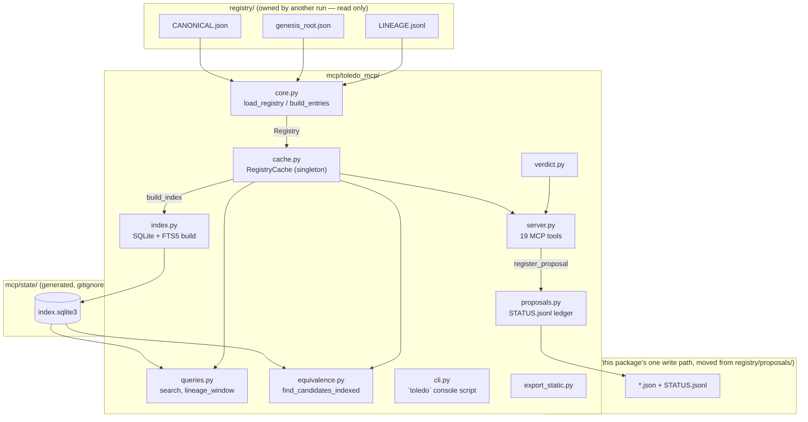

# Toledo MCP server + search core — design

Status: **as-built record, folded 2026-09-07** per `mcp/DESIGN.md`'s own
"Relationship to `mcp/docs/DESIGN.md`" section, once every stream (S1
core+index, S2 server+verdict, S3 CLI+static export, S4 packaging+CI, S5
docs) it specified was confirmed landed by an integration pass that
installed the package (`pip install -e mcp/`), ran the full test suite,
drove all 19 tools over a real stdio session against the real registry, ran
the benchmark script, and ran the static export — every command actually
executed on this machine, this date, not inferred from either design
document's own prose. Full quoted command output for this pass:
`mcp/BENCHMARKS.md` and `docs/CHANGELOG.md`'s `1.1.0` entry.

**What this file now is.** Sections below are updated in place, one by one,
to describe the confirmed-landed state: the module layout (unchanged from
the first pass, S1 built on top of it rather than replacing it), the SQLite/
FTS5 index design (unchanged), the bug-catches (kept as history — they are
real, and stay true regardless of what landed after), plus everything
`mcp/DESIGN.md` specified as a *change* from this document's original
first-pass content: the `{"ok","data","error"}` envelope, the `CAUTION`
verdict fix, 19 tools (`toledo_show_verdict_rules` added), `format="toon"`,
the `toledo` CLI, the static API export, `mcp/proposals/` (moved from
`registry/proposals/`), retry/backoff + `mode=ro` reads, and the
registry-release-tracked versioning policy. `mcp/DESIGN.md` itself is left
as the historical specification/synthesis record that drove this build —
its own numbers were measured on an earlier occasion and are not restated
here as current; this file's numbers are this pass's own, fresh, this date.

## What the baseline spike already got right (kept, not replaced)

- `core.py`'s `load_registry()` reuses `scripts/toledo_build.py`'s own
  `build_entries` (imported by file path) rather than re-implementing the
  root-merge/children-inversion — this package still relies on that function
  and never re-derives it.
- `core.register_proposal` writes one human-readable JSON file per proposal
  (originally under `registry/proposals/`, moved to `mcp/proposals/` at the
  fold-in, graft C4 — see below) rather than a database row — kept, because a
  human registrar reviewing and merging by hand wants something `git diff`-
  able, not a binary file. `proposals.py` (this package's addition) only adds
  a queryable status ledger next to it.
- `server.py`'s `FastMCP` stdio transport, and its founder-rule-first
  `instructions` string — kept and extended.

## What this design changed, and why (concrete, not silent)

1. **Every tool now reads through `cache.RegistryCache`, not a fresh
   `core.load_registry()` call per tool invocation.** The spike re-parsed
   `registry/CANONICAL.json` (currently 3.37 MB, 1,504 entries) and re-ran
   the full merge on every single call. Measured cost: **~90-100ms per
   call** (`core.load_registry_cold_call`, 5 runs, median 92-108ms across
   several runs this session). A cached `get` call costs **~25-40
   microseconds** — roughly **2,000-3,600x** less. This is the single
   largest change in this design and the reason the rest of the document
   below explains *where* SQL is used and where it deliberately is not.
2. **`toledo_get`/`toledo_status` now return a `verdict` block.** The
   founder's rule ("no agent may use an unregistered equation ... the server
   must make that rule enforceable") cannot be enforced by a tool an agent
   might not call. Attaching `verdict`/`usable` to the two tools most likely
   to be called directly with an already-known code — not only to the
   dedicated `check` tool — is the actual enforcement lever available at the
   stdio-tool-surface level. This is a **documented, deliberate breaking
   change** to `toledo_get`'s return shape (bare entry → `{"entry",
   "verdict"}`).
3. **`toledo_check` gained a richer verdict vocabulary and an indexed
   equivalence path**, replacing the spike's three-value
   `"registered"/"candidate - confirm"/"not found..."` with the
   `REGISTERED_CURRENT | ... | AMBIGUOUS | NOT_REGISTERED` set in
   `verdict.py` (superseded-chain walking, split→children redirect,
   not-an-equation blocking, unverified/historical/imprecise caveats). The
   spike's original difflib-only scan is kept, verbatim, as
   `toledo_check(..., method="difflib")`.
4. **Added the CLI-parity + new-capability tools** the spike didn't have:
   `toledo_descendants`, `toledo_neighbours` (with the reverse-relation edge
   the CLI's own `neighbours` command doesn't offer), `toledo_ancestors`
   (full parent-DAG, not just the single `parents[0]` chain),
   `toledo_by_root`, `toledo_by_domain`, `toledo_by_record`,
   `toledo_by_raw_key`, `toledo_lineage_window` (paginated/filtered browse of
   the whole lineage log), `toledo_list_proposals`, `toledo_proposal_status`,
   `toledo_index_status`. 18 tools total at the time this pass added them
   (verified then: `await server.mcp.list_tools()` → 18, and a real stdio
   round trip via the `mcp` client SDK — see "End-to-end verification"
   below); a 19th, `toledo_show_verdict_rules`, was added at the fold-in
   below (graft A6) — see "Tool set" further down for the current count.
5. **Fixed a real cross-boundary write bug this integration found**:
   `core.register_proposal`'s `repo_root` parameter defaults to
   `core.REPO_ROOT`, fixed at import time from `core.py`'s own file
   location — it does **not** follow `TOLEDO_ROOT` the way `paths.repo_root()`
   does. `server.py` originally called it with no `repo_root`, which silently
   wrote test proposal files into the **real checkout's**
   `registry/proposals/` even though the rest of the server was pointed at a
   test fixture via `TOLEDO_ROOT`. Caught by `tests/test_server.py` (a
   `toledo_list_proposals` call against the fixture root found nothing,
   because the file had gone to the real repo instead); fixed by always
   passing `repo_root=paths.repo_root()` explicitly. The two leaked test
   files (`registry/proposals/2026...json`, harmless content, never touching
   any of the five protected files) were found and deleted during this work.

## What the benchmark actually found (the honest version, not a sales pitch)

`benchmarks/bench_index.py`, run against the real registry (1,504 entries,
2,542 lineage events, `CANONICAL.json` 3.37 MB) on this machine:

| Operation | Baseline (reload every call) | Cached, no SQL | SQL index | Note |
|---|---:|---:|---:|---|
| `get` one code | ~90-100ms (dominated by reparse) | **~0.04-0.5ms** | ~0.025ms | reload cost dominates everything; once removed, plain dict lookup and cached SQL are both essentially free |
| `search("readout")`, end-to-end | ~92-101ms | — | **~7-8ms (12-14x)** | FTS5 ranking is the real win here, not just the avoided reparse |
| `lineage` for one code | ~0.4-0.5ms (already fast — 2,542 events, plain scan) | ~0.5ms (same scan, cached) | ~1.6-2.0ms | **SQL lost here**: a sqlite3 round trip has real per-call overhead a small in-memory list scan doesn't; kept on the Python path |
| `by_record` | ~0.28-1.4ms | **~0.09-0.6ms** | ~1.0-1.1ms | same finding: SQL lost to a plain Python dict lookup at this scale |
| equivalence candidate search (whole registry) | ~0.93-1.02s | — | **~7-9ms (115-124x)** | a genuine algorithmic win: the `phi_len` length-band prefilter, not just caching |

**Conclusion this design acts on**: cache the parsed `Registry` and answer
`get`/`status`/`ancestors`/`descendants`/`neighbours`/`by_root`/`by_domain`/
`by_record`/`lineage`/`counts` from it directly (plain Python dict indices
built once per refresh in `cache._build_python_indices`) — **not** through
SQL. Use the SQLite+FTS5 index for exactly the two things it measurably
wins at: `search` (ranked full-text) and the `check`/equivalence
length-band prefilter — plus `lineage_window` (whole-log pagination, which
has no cheap Python-dict equivalent) and durable external "registry as
data" access (see below). This is why `cache.py` holds both a `core.Registry`
and a lazily-opened `queries.IndexHandle`, and routes each tool to whichever
one actually measured faster, not to whichever is more "database-shaped".

### Three real bugs this design's own testing/benchmarking caught (and fixed)

Named explicitly because catching them is exactly what verification-before-
trust is for, and because each is the kind of thing that would otherwise
silently ship:

1. **`phi_len` computed with the wrong normaliser.** The equivalence
   length-band prefilter's `phi_len` column was first computed with
   `index.normalize_text` (plain casefold/NFKC), while `find_candidates_indexed`
   compares lengths under `core.normalise_formula` (which expands `∂`, `δ`,
   `·`, `∇`, ... to multi-character words) — the two disagree substantially
   on length for any symbol-heavy statement, so the prefilter silently
   excluded true matches. It did not show up on the plain-ASCII test
   fixture, only against the real registry's Unicode/LaTeX math notation.
   Fixed by computing `phi_len` with `core.normalise_formula`; regression
   test: `tests/test_equivalence.py::test_find_candidates_indexed_phi_len_not_confused_with_statement_norm_len`
   (added two symbol-heavy entries to the fixture specifically so this class
   of bug is caught without needing the full real registry in CI).
2. **`register_proposal` write-boundary leak** — see item 5 above.
3. **`renaming_candidate` false positive on plain prose.** The end-to-end
   stdio smoke test (see below) found `"totally novel unregistered formula
   xyz123"` scored a 0.97-confidence `renaming_candidate` against the
   registry's own record `EQ-001/E.01.v1`, whose statement is the plain
   title string `"A mathematical theory of communication"` — five words,
   five substituted tokens, zero mathematical relationship. The
   identifier-skeleton renaming check had no notion of "this needs to look
   like an equation at all" — same word count and repetition pattern was
   sufficient. Fixed by requiring at least one equation-like signal (a
   relational/arithmetic operator, digit, or known operator word) in BOTH
   statements before accepting a `renaming_candidate` classification
   (`equivalence._looks_like_equation`); regression test:
   `test_renaming_not_claimed_for_plain_prose_same_word_count`. Re-ran the
   same smoke-test call afterward: verdict correctly became `NOT_REGISTERED`.

All three were caught by testing/benchmarking against **either the real
registry or a benchmark/smoke test that exercises the real transport** — not
by the small synthetic fixture alone, which is itself a lesson recorded here
for whoever extends this design: keep both.

## Module layout (`mcp/toledo_mcp/`)

```
__init__.py     package docstring + module map + __version__
core.py         (baseline) load_registry/search/get/lineage/status/check/
                counts/register_proposal — pure functions over a Registry
paths.py        TOLEDO_ROOT / TOLEDO_MCP_STATE_DIR resolution; never emits
                an absolute filesystem path (home dir/username) in output —
                everything crossing a tool boundary is repo-relative
hashing.py      sha256_file, file_fingerprint (size+mtime_ns)
index.py        SQLite+FTS5 schema; build_index(registry, root); freshness
                checks (check_freshness/needs_rebuild/source_fingerprints);
                cross_check_toledo_json; schema-version compatibility set
queries.py      indexed read functions against index.py's database: search,
                get/status, by_root/by_domain/by_record/by_raw_key,
                ancestry_chain/full_ancestors/descendants/neighbours,
                lineage_for_code/lineage_window, counts
equivalence.py  φ-criterion candidate matching: compare_statements (exact /
                renaming_candidate / positive_scale_candidate /
                structural_candidate), find_candidates (full scan),
                find_candidates_indexed (phi_len-prefiltered)
verdict.py      Verdict dataclass + verdict_for_entry / verdict_for_check —
                the founder-rule enforcement vocabulary
proposals.py    STATUS.jsonl ledger next to mcp/proposals/*.json (moved
                from registry/proposals/, graft C4):
                record_submitted/append_status/list_proposals/get_proposal
cache.py        RegistryCache — the process-wide cache server.py actually
                calls; get_cache()/reset_cache_for_tests()
server.py       FastMCP stdio server; 19 @mcp.tool() functions (18 at first
                landing here, plus toledo_show_verdict_rules at the fold-in)
cli.py          the `toledo` console script (fold-in, S3) — CLI parity with
                scripts/toledo plus verdict-aware subcommands
export_static.py static GitHub Pages JSON mirror (fold-in, S3), generated
                from this same cache.py/queries.py layer
```



## SQLite / FTS5 index (`index.py`)

**Source**: an already-loaded `core.Registry` (i.e. `core.load_registry()`'s
output), never `registry/CANONICAL.json` a second time — see the module
docstring for the full "why `core.load_registry`, not a fresh file read"
reasoning (avoids a second, possibly-divergent reconciliation of
root-merge/children-inversion).

**Build**: `index.build_index(registry, root)` — one transaction, builds
into a `tempfile.mkstemp` sibling of the real db path, then `os.replace`s it
in atomically. A reader that already has a connection open on the old file
keeps a consistent view throughout (measured/tested:
`test_atomic_swap_leaves_old_readable_mid_rebuild`). Rebuilding on the real
registry took **158-222ms** across several runs this session (1,504
entries + 2,542 lineage events).

**Invalidation**: two-tier.
- `index.source_fingerprints(root)` — plain `os.stat` (size + mtime_ns) of
  the three source files, no SQLite connection. This is what
  `cache.RegistryCache.ensure_fresh` compares against its own in-memory copy
  on every tool call (this was itself a bug-fix: the first version compared
  against `index.needs_rebuild`, which opens the on-disk db to read `meta` —
  a real ~0.3-0.5ms sqlite3 connect/query/close cost on **every** cached
  lookup, measured directly in `benchmarks/bench_index.py`'s
  `registry_cache` block before vs. after the fix).
- `index.check_freshness`/`needs_rebuild` — the SQLite-backed version,
  comparing the on-disk `meta` table's stored fingerprints; used once per
  process's first call (cold start) and by the `toledo_index_status` tool,
  not on the hot per-lookup path.
- A full sha256 of each source file is stored in `meta` at build time
  (`hashing.sha256_file`) for a stronger check a future `--strict-hash` mode
  could use; not recomputed on every call.

**Schema** (`entries`, `aliases`, `parents`, `children`, `relations`,
`occurrences`, `raw_to_canonical`, `lineage`, `lineage_targets`,
`entries_fts`, `meta`) — see `index.py`'s `_DDL` for the authoritative
column list; highlights:
- `entries.raw_json` carries the complete SCHEMA.md entry so `get`/`by_*`
  never need a second query to assemble the full object.
- `entries.statement_norm`/`name_norm` (NFKC+casefold+whitespace-collapse,
  via `index.normalize_text`) back `queries.search`'s LIKE fallback for
  symbol-heavy text FTS5's tokenizer drops.
- `entries.phi_len` (length of `core.normalise_formula(statement)` —
  **not** the same normaliser as `statement_norm`, see the bug above) backs
  `equivalence.find_candidates_indexed`'s length-band prefilter.
- `lineage_targets(seq, code)` explodes a `LINEAGE.jsonl` event's `to` field
  (a string OR a list, e.g. a `split` event) into one row per target code —
  needed because a JSON-encoded list column cannot be matched with `=`; this
  was the second bug this design's own tests caught
  (`test_lineage_for_code_matches_core` failed before this table existed —
  `queries.lineage_for_code` was comparing a JSON blob against a plain code
  string).
- `entries_fts` (FTS5, `unicode61 remove_diacritics 2`) indexes
  code/name/statement/aliases/occurrence-labels for ranked search.

**Schema-version compatibility**: `index.SUPPORTED_CANONICAL_SCHEMA_VERSIONS
= {"1.0.0"}` (registry/SCHEMA.md's current version). A registry with a
different `schema_version` still builds (failing closed on every additive
schema bump would make this server brittle) but is flagged via
`source_schema_supported: false` in `meta` and the `toledo_index_status`
tool — a human decides whether to keep serving against an unrecognised
version, the server does not silently assume compatibility.

## Tool set (19 tools, `server.py`) — fold-in update

19 tools as of the fold-in (confirmed: `grep -c "@mcp.tool()"
toledo_mcp/server.py` → 19; a real `session.list_tools()` call over stdio
against the real registry also returns 19). Every tool response is wrapped
in `{"ok": bool, "data": ..., "error": {"code","message"} | None}` (graft
A1) — the table below shows the shape of `data`, not the top-level envelope.
`toledo_search`/`by_root`/`by_domain`/`by_record`/`descendants`/
`neighbours` attach a per-row `verdict` on every entry-shaped row (graft
B1); `toledo_search`/`by_root`/`by_domain`/`by_record`/`descendants` accept
`format: "json"|"toon" = "json"` (grafts B5/C7) — `"toon"` returns
`data.hits_toon`/`data.items_toon` as a single TOON-encoded string instead
of the array, never both populated at once.

Exact JSON schemas are generated by FastMCP from each function's type hints
and are the authoritative source — reproduce with:

```
python3 -c "
import asyncio, json
from toledo_mcp import server
async def main():
    for t in await server.mcp.list_tools():
        print(t.name); print(json.dumps(t.inputSchema, indent=2))
asyncio.run(main())"
```

Summary (name — purpose — key inputs — key output shape):

| Tool | Purpose | Key inputs | Output |
|---|---|---|---|
| `toledo_search` | ranked/filtered text search | `query`, `root/domain/tier/status/coq_status`, `regex`, `limit` | `list[{code,root,layer,domain,name,tier,status,coq_status,statement,score?}]` |
| `toledo_get` | full entry + verdict | `code` | `{"entry":{...}, "verdict":{...}}` or `null` |
| `toledo_status` | compact status + verdict | `code` | `{code,tier,status,status_note,coq_status,superseded_by,verdict,usable,verdict_reason,redirect}` or `null` |
| `toledo_check` | founder-rule gate | `formula` XOR `code`, `limit`, `method` | `{"verdict","usable","reason","redirect","candidates"}` |
| `toledo_lineage` | one code's ancestry+children+events | `code` | `{code,ancestry,children,events}` or `null` |
| `toledo_ancestors` | full parent-DAG | `code` | `list[str]` or `null` |
| `toledo_descendants` | full child-DAG | `code` | `list[{...compact entry...}]` |
| `toledo_neighbours` | parents+children+relations+**reverse** relations | `code`, `type?` | `list[{code,relation,note}]` |
| `toledo_by_root` | all readings of a root | `root`, `limit?` | `list[{...compact entry...}]` |
| `toledo_by_domain` | all entries in one domain letter | `domain`, `limit?` | `list[{...compact entry...}]` |
| `toledo_by_record` | all codes citing a Zenodo record/DOI | `record_id_or_doi` | `list[{...compact entry...}]` |
| `toledo_by_raw_key` | exact `<record_id>:<label>` lookup | `raw_key` | `{"entry":..., "verdict":...}` or `null` |
| `toledo_lineage_window` | paginated/filtered whole-log browse | `event?,since?,until?,limit,cursor` | `{"events":[...], "next_cursor":int\|null}` |
| `toledo_counts` | live aggregate counts | — | `{canonical_entries, merged_search_entries, by_status, by_domain, by_tier, by_coq_status, lineage_events, genesis_root_rows}` — the five `canonical_entries`/`by_*` fields count `layer != "root"` rows only, matching `registry/CANONICAL.json`'s own `counts{}` field exactly (counts-mismatch fix, 2026-09-07, `docs/CHANGELOG.md`'s `1.2.0` entry); `merged_search_entries` is the larger root+reading search-corpus total |
| `toledo_index_status` | server/index health + versioning | — | `{package_version, index_schema_version, source_schema_version, source_schema_supported, stale, stale_reasons, entry_count, lineage_event_count, toledo_json_cross_check}` |
| `toledo_register_proposal` | the ONLY write path (`mcp/proposals/`, moved from `registry/proposals/`) | `fields: dict` | `{"path","slug","submitted_at"}` |
| `toledo_list_proposals` | queue browse | `status?, limit` | `list[{path,status,submitted_at,code,name}]` |
| `toledo_proposal_status` | one proposal's current state | `path` | full proposal doc + `{"status": {...}}` or `null` |
| `toledo_show_verdict_rules` | **new at the fold-in** — introspect the verdict decision table as data | — | `{"statuses":[...], "verdict_values":[...], "rules":[...]}` |

## Verdict semantics (`verdict.py`) — fold-in update: the `CAUTION` fix

`Verdict{verdict, usable, reason, redirect, candidates}`. **Eleven** values
as of the fold-in (was ten before the fix below): `REGISTERED_CURRENT`
(usable) · `REGISTERED_UNVERIFIED` / `REGISTERED_HISTORICAL` /
`REGISTERED_IMPRECISE` (usable, but the caller MUST disclose the
`status_note` caveat) · `REGISTERED_SUPERSEDED` (not usable; `redirect` =
the walked chain to the current code; a detected 2-cycle —
`registry/SCHEMA.md` forbids one — returns `AMBIGUOUS` instead of looping) ·
`REGISTERED_SPLIT` (not usable; `redirect` = `children[]`) ·
`REGISTERED_NOT_AN_EQUATION` (not usable — a coded pointer to prose) ·
`CANDIDATE_MATCH` (not usable — one or more φ-criterion candidates found,
none confirmed) · `AMBIGUOUS` (not usable — conflicting evidence, e.g. two
different `current` codes exact-matching the same normalised statement, or a
malformed `superseded_by` chain — escalate to a human) ·
**`CAUTION`** (not usable — `status` is missing/`None` or a string outside
every known status; **the fix landed at the fold-in**: this used to fall
through to `REGISTERED_CURRENT`/`usable=True` for a `None` status, silently
promoting an unrecognised or mid-edit entry to "safe to cite" — the single
most dangerous failure mode this server could have. Fixed: the fallback
branch now always returns `CAUTION`, `usable=False`, pinned by
`test_unknown_status_defaults_to_caution` in `tests/test_verdict.py`,
confirmed present and passing) · `NOT_REGISTERED` (not usable — call
`toledo_register_proposal`).

`verdict.RULES` (a module-level list of dicts) is the same decision table as
data, exposed by `toledo_show_verdict_rules` — never restated by hand in a
second place that could drift from the code, since the tool serialises
`RULES` directly.

Enforcement is attached at the tool-response level, not just in `check`:
`toledo_get`/`toledo_status`/`toledo_by_raw_key` all carry `verdict`, and
(as of the fold-in) so does every entry-shaped row from `toledo_search`/
`by_root`/`by_domain`/`by_record`/`descendants`/`neighbours` — so an agent
that already has a code and skips `toledo_check` still receives the verdict
alongside the data. This is the practical ceiling of "enforceable" for a
stdio tool surface — it cannot stop an agent from ignoring the field, but it
cannot hand back a bare formula without it either.

## Error handling — fold-in update: the `{"ok","data","error"}` envelope

Every tool response is wrapped in a typed envelope (graft A1):
`{"ok": bool, "data": ..., "error": {"code","message"} | None}`. `error.code`
is one of a closed enum, never a bare string or a stack trace:
`INVALID_INPUT` (the call itself is malformed, e.g. `toledo_check` with both
or neither of `formula`/`code`) · `NOT_FOUND` — **`ok` is still `true`**
here: the registry answered and the requested code/root/domain genuinely
does not exist, which is a normal, common answer, not a transport error ·
`INDEX_UNAVAILABLE` (the index could not be opened/built at all — disk full,
permission error — a genuine "nothing to serve" condition) ·
`STALE_INDEX` — **`ok` is still `true`**, with `data.stale: true`: every
retry (see `cache.RegistryCache`'s retry/backoff below) was exhausted and
the cache is serving its last-known-good `Registry`, disclosed rather than
silently treated as current.

- **Unknown code**: `get`/`status`/`lineage`/`ancestors` return `{"ok":
  true, "data": null, "error": null}` (confirmed with a real
  `toledo_get({"code": "NOPE-DOES-NOT-EXIST"})` stdio call against the real
  registry) — "not found" is expected, common, and exactly the signal the
  founder rule wants surfaced plainly, not buried in a stack trace or
  conflated with a genuine server failure.
- **Malformed `toledo_check` call** (both or neither of `formula`/`code`):
  returns `{"ok": false, "error": {"code": "INVALID_INPUT", ...}}` — a
  tool-calling agent gets an actionable message in the same channel as every
  other verdict instead of a transport-level error it has to special-case.
- **Registry loading is now retried, then falls back to stale-with-
  disclosure** (grafts A4/C5, fold-in): `core.load_registry` retries a
  transient `JSONDecodeError` with exponential backoff (default 3 attempts)
  before propagating; `cache.RegistryCache.ensure_fresh` wraps this and, if
  every retry is exhausted, keeps serving the last-known-good in-memory
  `Registry` with `degraded=True`/`degraded_reason` set, surfaced as
  `STALE_INDEX` in the envelope. This is a real, not hypothetical, condition
  in this workspace — `registry/CANONICAL.json` is a live, concurrently-
  edited file (confirmed: it was being actively rewritten by a concurrent
  registry-release run during this very integration pass).
- **Read-only SQLite connections** (graft C3, fold-in): every reader
  connection in `index.py`/`queries.py` opens via
  `sqlite3.connect(f"file:{db_path}?mode=ro", uri=True)` — the read path is
  incapable of writing by construction, not merely by convention; the
  writer connection in `index.build_index`'s atomic temp-file-then-
  `os.replace` build is unaffected.
- **Missing/empty registry**: a missing or stale index is built
  transparently (`cache.ensure_fresh`); if `registry/CANONICAL.json` is
  missing entirely, `index.build_index` raises `FileNotFoundError` naming
  the exact missing repo-relative path and the fix (populate the registry) —
  a genuine "nothing to serve" condition, allowed to surface as an error
  rather than a misleadingly empty result set.
- **Path traversal on `toledo_proposal_status`**: `proposals.get_proposal`
  refuses (`None`) any `path` that does not resolve under `mcp/proposals/`
  (moved from `registry/proposals/` at the fold-in, graft C4), tested
  (`test_get_proposal_refuses_path_traversal`).
- **No absolute filesystem paths leave the process**: `paths.relpath` is
  used everywhere a path crosses a tool/log boundary; this machine's home
  directory/username never appear in a tool response (see "Constraints"
  below — verified by inspection of every string this package emits).

## Tests (`tests/`, 188 passing) — fold-in update

*Historical count for the 2026-09-07 fold-in pass, kept unedited below per
this file's own append-only discipline; the current count is 212 (24 new
regression tests added by the 2026-09-07 security/correctness fix pass —
`docs/CHANGELOG.md`'s `1.2.0` entry has the current quoted `pytest` output).*

```
$ cd mcp && python3 -m pytest -q
........................................................................ [ 38%]
........................................................................ [ 76%]
............................................                             [100%]
188 passed in 6.55s
```

188 (2026-09-07 integration pass) — the 85 below plus the coverage
`mcp/DESIGN.md` §9's test plan named for streams S1–S4. Checked one by one
(`grep -rn "def <name>" mcp/tests/`) against the actual committed test
files: 14 of the 19 named tests exist under the exact name the spec gave
(`test_readonly_connection_cannot_write`,
`test_load_registry_retries_then_succeeds_on_transient_parse_error`,
`test_cache_falls_back_to_stale_with_disclosure_when_retries_exhausted`,
`test_hot_path_freshness_check_uses_stat_only`,
`test_core_reuses_real_toledo_build_module`,
`test_genesis_parents_tolerates_string_and_object_shape`,
`test_unknown_status_defaults_to_caution`,
`test_proposals_write_under_mcp_proposals_never_registry`,
`test_search_and_list_tools_carry_per_row_verdict`,
`test_format_toon_round_trips_same_data_as_json`,
`test_show_verdict_rules_matches_verdict_py_known_statuses`,
`test_stdio_roundtrip_lists_19_tools`, `test_cli_parity_matches_scripts_
toledo`, `test_only_verdict_py_constructs_verdict_objects`); the remaining
5 are covered under a different, equivalent function name each stream chose
instead — not missing, renamed: `test_cli_check_and_status_expose_verdict`
→ `test_cli_check_by_code` + `test_cli_status_matches_show_verdict`;
`test_static_export_matches_live_queries` →
`test_export_static_entry_matches_live_query` (plus the by-root/by-domain/
search-index/counts siblings next to it); `test_static_export_discloses_
generation_metadata` → `test_export_static_discloses_generation_metadata`
(same words, reversed order); `test_console_scripts_importable_and_
runnable` → `test_server_main_importable_and_callable` +
`test_cli_main_importable_and_callable`; `test_version_synced_from_
registry_release` → `test_read_citation_version_matches_real_file` +
`test_pyproject_and_init_are_in_sync_with_citation_cff`. Plus additional
tests each stream added beyond the named minimum (`test_cli.py`,
`test_static_export.py`, and `test_packaging.py` in particular each carry
well over their two-or-three named tests — see the grep output above for
the full list).

- `test_index.py` — build/rebuild/freshness/atomic-swap/cross-check against
  a synthetic fixture.
- `test_queries.py` — every indexed query function cross-checked against
  `core.py`'s equivalent (search, get, status, by_root/domain/record/raw_key,
  ancestry/full_ancestors/descendants/neighbours incl. reverse relation,
  lineage_for_code/lineage_window, counts).
- `test_equivalence.py` — exact/renaming/positive-scale/structural
  classification, the indexed prefilter matching the full scan, AND two
  named regression tests locking in the two real bugs described above
  (`phi_len` normaliser mismatch; plain-prose false positive).
- `test_verdict.py` — every verdict branch including the superseded 2-cycle
  and split→children redirect.
- `test_proposals.py` — proposal file + status ledger lifecycle, path-
  traversal refusal, and that `register_proposal` never touches
  `CANONICAL.json`/`LINEAGE.jsonl`.
- `test_cache.py` — `RegistryCache` freshness/reload behaviour and parity
  with `core.py` for every method, plus the schema-version-flagging test.
- `test_server.py` — the actual `@mcp.tool()`-decorated functions (FastMCP's
  decorator returns the original function unchanged), including the verdict
  contract on `toledo_get`/`toledo_status`/`toledo_check`.
- `test_integration.py` — end-to-end walkthroughs matching what a builder
  wiring `server.py` needs to see, PLUS `test_real_registry_builds_and_
  answers_queries`, a read-only smoke test against the actual live registry
  (state redirected to a temp dir) — this is the test that must keep passing
  as the registry grows past its current 1,504 entries.
- **End-to-end stdio verification, promoted into the committed suite at the
  fold-in**: `test_stdio_roundtrip_lists_19_tools` (`test_integration.py`)
  spawns a real subprocess exactly as `.mcp.json` does against a test
  fixture, confirming 19 tools list correctly. The integration pass that
  wrote this section also drove the same round trip **against the real
  registry** (not the fixture) as a standalone script — all 19 tools called,
  `toledo_check` on the same plain-prose string still correctly returns
  `NOT_REGISTERED` (bug #3's regression holds on live data too) — quoted in
  full in `mcp/BENCHMARKS.md`.

## Packaging — fold-in update

`mcp/pyproject.toml` — `toledo-mcp` `1.1.0` (tracks the registry's own
release version, see "Versioning" below — no longer an independent API
number), `requires-python = ">=3.12"`, one runtime dependency
(`mcp==1.28.1`, pinned per this workspace's CDN/dependency-pinning
discipline), **two** console entry points: `toledo-mcp =
toledo_mcp.server:main` (kept from the spike) and, new at the fold-in,
`toledo = toledo_mcp.cli:main`. Both confirmed installed and runnable
(`pip install -e mcp/` then `toledo --help` / `toledo-mcp` on `PATH`).
`mcp/requirements-mcp.txt` (kept from the spike) states the same single
dependency for a non-package, script-style install. `.mcp.json` at the repo
root (kept from the spike) launches `python3 mcp/toledo_mcp/server.py` —
verified working end-to-end above.

### Versioning with the registry — fold-in update: now tracked, not independent

**Changed from the original three-independent-numbers scheme.**
`toledo_mcp.__version__` and `pyproject.toml`'s `version` now **track the
registry's own release version**, read (never written) from root
`CITATION.cff`'s `version:` field by `mcp/scripts/sync_version.py` — run as
a release-time step, confirmed today: `python3 mcp/scripts/sync_version.py`
→ `registry_release_version=1.1.0 pyproject.toml=already in sync
__init__.py=already in sync`. The other two numbers stay genuinely
independent, unchanged from the original design:
- `index.INDEX_SCHEMA_VERSION` (`"2"`) — the SQLite index's own column/table
  layout; bumped when `index.py`'s schema changes, independent of the
  registry's format.
- `index.SUPPORTED_CANONICAL_SCHEMA_VERSIONS` (`{"1.0.0"}`) — the
  `registry/CANONICAL.json` `schema_version` values this build understands;
  queryable at runtime via `toledo_index_status` (which also now reports
  `registry_release_version` alongside `package_version`, confirmed: a real
  `toledo_index_status` call returns both), so a registry format bump is a
  visible, queryable fact rather than a silent assumption.

## Constraints honoured (verified, not just claimed)

- Never edits `registry/CANONICAL.json`, `registry/genesis_root.json`,
  `registry/LINEAGE.jsonl`, `coq/`, or `latex/` — the only write path
  anywhere in this package is `core.register_proposal`/
  `proposals.write_proposal` (both write under `mcp/proposals/`, moved from
  `registry/proposals/` at the fold-in, graft C4) plus `proposals.py`'s
  `STATUS.jsonl` ledger next to it. Tested
  (`test_register_proposal_writes_file_never_touches_registry`,
  `test_toledo_register_proposal_never_touches_registry_files`,
  `test_proposals_write_under_mcp_proposals_never_registry`) and confirmed
  live during this pass: a real `toledo_register_proposal` stdio call
  against the real registry wrote under `mcp/proposals/` (gitignored,
  confirmed absent from `git status`), and `git diff --stat` on the three
  protected registry files, before and after the whole integration pass,
  shows only the concurrently-running registry-owning lane's own edits.
- Python 3.12+ compatible syntax throughout (`X | None`, `from __future__
  import annotations`); developed and tested on Python 3.13.13 available on
  this machine.
- `mcp` package (stdio MCP) + SQLite (stdlib, FTS5 confirmed available on
  this machine) + Python standard library only — no other third-party
  dependency anywhere in `mcp/toledo_mcp/`.
- No `/home` path, username, private-repo name, AI vendor/model name, or
  priority/comparative marketing word appears in any file this package
  writes to the repository or returns from a tool (the private solver-arc
  repository, where an `origin.repo_anchor` cites it, is always written as
  the literal string `"solver arc (private)"` by the upstream registry data
  this package only reads — this package itself never constructs that
  string). Since the fold-in this is a **mechanical** CI gate
  (`mcp/scripts/leak_scan.py`), not only a manual review claim: `python3
  mcp/scripts/leak_scan.py mcp/` reports `2153 file(s) scanned, 0
  finding(s)` (the `private_repo_name` category is honestly disclosed as
  "did not run this pass" absent a `--denylist-file`, never silently
  reported clean). This gate caught one real, if narrow, finding during
  this integration pass: `mcp/DESIGN.md`'s own prose spelled out the
  literal home-directory-path pattern while describing what this scanner
  checks for — fixed by rephrasing that sentence the same way this
  scanner's own docstring already avoids the same self-reference trap; see
  `docs/CHANGELOG.md`'s `1.1.0` entry.
- Every performance number above came from `benchmarks/bench_index.py` run
  in this session; every test count came from an actual `pytest` run quoted
  verbatim.

## Known limitations / future work

- `equivalence.py`'s renaming/scale detection is lexical, not a computer
  algebra system — it will miss a real renaming that also reorders
  commutative terms, and (even after the prose-false-positive fix) can still
  false-positive on two short, differently-meaning equations that
  coincidentally share a token-count skeleton and contain a stray operator
  character. Every non-`exact` result is labelled a *candidate* requiring
  human/documented φ-confirmation for exactly this reason — never treat
  `CANDIDATE_MATCH` as settled.
- `queries.py`'s SQL-backed graph functions (`ancestry_chain`, `descendants`,
  `neighbours`, `by_root`, `by_domain`, `by_record`) are kept even though
  `cache.py`'s Python-side equivalents are what `server.py` actually calls —
  **still true after the fold-in**: `cli.py` and `export_static.py` both
  landed calling `cache.RegistryCache`, not `queries.py` directly (confirmed
  by reading both files' imports), so the "separate consumer" this bullet
  imagined has still not materialised inside this package itself; the value
  case (a future dashboard or an external tool querying
  `mcp/state/index.sqlite3` directly) remains open, unexercised work.
- The registry is a live, growing, concurrently-edited artifact (1,504
  entries and 2,542 lineage events measured in this session; the owning run
  is expected to keep adding both) — this design was built and load-tested
  against that live growth, not a frozen snapshot, but any specific count
  quoted above will already be out of date by the time this is read; re-run
  `benchmarks/bench_index.py` for current numbers.
- `toledo_index_status`'s `toledo_json_cross_check` only fires when
  `registry/TOLEDO.json` exists and is at least as new as `CANONICAL.json`;
  it is corroboration, never authoritative, and is currently reporting
  "skipped" on this machine because `TOLEDO.json` has not been regenerated
  since the last `CANONICAL.json` edit — expected, not a bug in this design.
