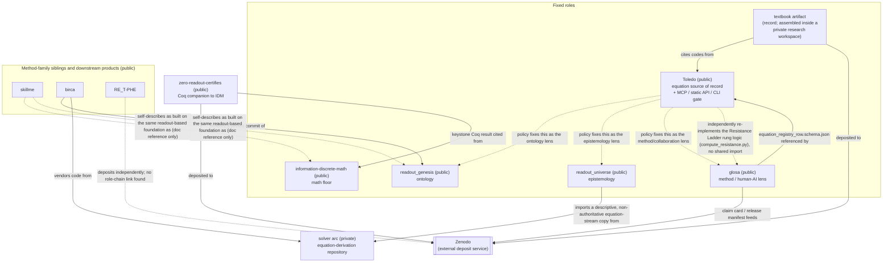

# Ecosystem map

Toledo does not sit alone. This page is a readout of how Toledo relates to the other public
repositories in the same programme — who cites Toledo, who Toledo cites, and how a question
about an equation or a claim actually moves through the system. It is a snapshot, not a
promise about how the system must stay; recheck the cited files for anything load-bearing.

## The map

Dotted edges are policy or documentation references; solid edges are a real file dependency,
import, or vendoring relationship found in the repositories themselves.

## Public interfaces

Toledo's own interfaces are marked in **bold**.

| Repo | Kind | Name | Entry | Contract (condensed) |
|---|---|---|---|---|
| **toledo** | mcp_server | **toledo (stdio, 21 tools)** | `mcp/toledo_mcp/server.py` | Search/get/status/check/lineage and related lookups over the registry, plus a lint tool over a statement's own text and an eval tool over a reviewed-eligible executable-equation IR sidecar; read-only except a proposal tool that drops a review file for a human registrar and never edits the registry itself. |
| **toledo** | cli | **toledo (mcp-package CLI)** | `mcp/toledo_mcp/cli.py` | find/show/ancestry/descendants/neighbours/export plus verdict-aware checks, from the cached/indexed layer. |
| **toledo** | cli | **scripts/toledo (registry-owning CLI)** | `scripts/toledo` | The same kind of lookups, read from the generated `registry/TOLEDO.json` — a separate tool from the mcp-package's CLI of the same name. |
| **toledo** | build_script | **toledo_build.py** | `scripts/toledo_build.py` | Generates every downstream surface (JSON export, vault, site, graph, static API, catalogue) from `registry/CANONICAL.json`. |
| **toledo** | static_http_api | **Toledo static read API** | `mcp/toledo_mcp/export_static.py`, published at `https://morrocwi.github.io/toledo/` | HTTP GET on a periodic, eventually-consistent JSON mirror of the registry for callers without MCP access, including a corpus-wide Resistance Ladder tally (`v1/resistance-summary.json`) generated from the per-entry `resistance` block `scripts/compute_resistance.py` writes. |
| **toledo** | ci_workflow | **toledo-mcp-ci** | `.github/workflows/toledo-mcp-ci.yml` | Test / leak-scan / build-index / export-static+build-site → deploy-pages. |
| **toledo** | data_contract | **registry/CANONICAL.json + LINEAGE.jsonl** | `registry/CANONICAL.json`, `registry/LINEAGE.jsonl` | The single hand/tool-maintained source every downstream surface is generated from. |
| **toledo** | policy_document | **Toledo Equation Source Policy** | `EQUATION_SOURCE_POLICY.md` | Fixes Toledo as the sole source of record for existing equations; fixes ontology/epistemology/method roles to the sibling repos below. |
| glosa | mcp_server | glosa MCP server | `mcp/glosa_mcp_server.py` | 13 tools validating claim cards, review reports, citation cards, and blackbox notes, computing disclaimers/genre/gate decisions; state-changing tools require identity separation. |
| glosa | cli | glosa CLI | `cli/glosa` | intake/claim/review/release-gate/cite/ces/ret/lit/advise subcommands, each logging to a local ledger. |
| glosa | python_package_api | glosa kernel | `kernel/glosa_kernel.py` | The mechanical checks behind the CLI and MCP server: schema validation, identity separation, claim/review validation, release gating. |
| glosa | schema | glosa schema set | `schema/*.schema.json` | JSON Schema for every artifact the method produces (claim cards, review reports, release manifests, citation cards, knowledge-graph nodes/edges), including a schema Toledo entries can conform to. |
| glosa | ci_workflow | glosa CI | `.github/workflows/ci.yml` | Consistency, leak-scan, findings-completeness, and schema-validation gates; documented as not itself a release certification. |
| information-discrete-math | python-package-api | idm facade | `idm/__init__.py` | Returns a typed result tagged with a proof tier (Th_coqc / finite_diagnostic / an open marker). |
| information-discrete-math | http-api | idm.server REST API | `idm/server.py` | A stdlib HTTP server exposing solve/parse/health/docs endpoints. |
| information-discrete-math | cli | idm CLI | `idm/__main__.py` | Registry introspection (`list`, `kinds`, `describe`, `example`). |
| information-discrete-math | formal-verification | formal/ Coq theorem set | `formal/IDM_*.v` | Axiom-free proofs backing the highest proof tier. |
| readout_genesis | data-contract | Domain claim/drift registry files | `domains/*/CLAIM_BOUNDARY.json` etc. | Per-domain ledgers of claim tier, drift contract, and closure-audit status. |
| readout_genesis | ci-workflow | domain verification gates | `.github/workflows/*.yml` | Path-triggered test/fixture scripts per research domain. |
| readout_universe | plugin/skill | readout-universe skill | `.../skills/readout-universe/SKILL.md` | Tags a claim's evidentiary status with a tier label before it is stated as proven. |
| readout_universe | ci-workflow | verify workflow | `.github/workflows/verify.yml` | A 7-check reproduction gate: a logic-proof battery, a Coq compile, an evidence chain, a test suite, and two gate-typing checks. |
| readout_universe | data-contract/ledger | Executed-run ledger | `docs/VERIFIED_RUNS.md` | Every executed/numeric result cited in the docs is logged here before it is cited. |
| zero-readout-certifies | coq-theorem-module | IDM_KeystoneKernel | `coq/IDM_KeystoneKernel.v` | Proves the zero fibre of a finite weighted comparison operator is exactly its constant-on-components case. |
| zero-readout-certifies | ci-workflow | verify.yml | `.github/workflows/verify.yml` | Proof compilation across two proof-checker versions, PDF build, metadata validation, repository audit. |
| zero-readout-certifies | data-contract | deposit metadata | `.zenodo.json` | Metadata Zenodo's GitHub integration uses to mint the archival DOI on release. |
| solver arc (private) | python-package-api | rag_solver.solve | `rag_solver.py` (path within that repository withheld, per BBL-198) | Returns a verdict (TRUTH/QUALIFIED/HOLD/REJECT/ESCALATE) with citations and a claim tier. |
| solver arc (private) | mcp-server | rag MCP server | `mcp_server.py` (path within that repository withheld, per BBL-198) | A full solve, a fast evidence check, and corpus stats, each with a fixed honesty envelope in the response. |
| skillme | cli/kernel | skillme_protocol_kernel.py | `skillme_protocol_kernel.py` | Validates a checkpoint's structure; explicitly does not verify domain truth or legality. |
| birca | mcp-server | birca MCP server | `mcp_server/server.py` | Serves a safety-gated intake protocol plus compute tools for math-consistency and evidence-quotient checks; never calls a model itself. |
| RE_T-PHE | cli | build_library.py | `tools/build_library.py` | Admits only keep/fix-verdict evidence records into a generated library, listing dropped records visibly. |

## How a question travels

### An agent writing an equation

1. Start with a Toledo lookup — an MCP tool or the CLI's `find`/`show`/`check` against the
   registry, via its cached index. The response is a per-row verdict: usable / superseded /
   not-a-formula / candidate / not registered.
2. If not registered, the equation is not used silently. A registration proposal can be
   filed through the MCP server's proposal tool, which writes a review file for a human
   registrar — Toledo's only write path; it never edits the registry itself.
3. The write-up separately goes through glosa's Core Epistemic Structure: a claim card is
   filled in, validated, tagged with a proof tier, and checked for maker/checker/approver
   identity separation before release.
4. Once Toledo returns a usable verdict and the claim card passes glosa's release gate, the
   result is deposited to Zenodo, citing both the Toledo code and the claim-card id.
5. Any ontological or epistemological framing the write-up needs is cited from
   readout_genesis or readout_universe directly — Toledo's own policy forbids it from
   carrying that prose itself.

### A reader checking a claim

1. Start from the textbook (the deposited record) or a paper's own citation.
2. Follow the citation to its Zenodo deposit.
3. Resolve the cited Toledo code through the static read API or the CLI/MCP, landing on that
   entry's status, origin, and lineage in the registry.
4. If the entry is at the highest proof tier, follow it to the actual proof file and confirm
   it is axiom-free. If it sits lower, walk glosa's Resistance Ladder (R0–R6 rungs; the ladder
   score reads three signals only: Toledo's coq_status (R2), Reproduction Card fields
   (R1/R3/R4), and a review report's independence class (R5/R6 through the AOWC gate)).

### A new draft entering the system

1. Content is routed by role before it is accepted anywhere: equations to Toledo, ontology
   framing to readout_genesis, epistemology/tier framing to readout_universe,
   method/collaboration framing to glosa, record/assembly to the textbook.
2. The draft passes glosa's own gates — schema validation of its cards, independence and
   defeater checks, and a final release gate — before a release manifest is produced.
3. Only a passed release manifest makes the draft eligible for deposit to Zenodo, for
   citation from the textbook, or for registering a new Toledo entry.

Toledo's own scope stays fixed through all three flows: it holds the equation registry, the
lineage log, and the lookup gate over both — it carries no theories and no prose. Ontology
belongs to readout_genesis, epistemology to readout_universe, and the method/collaboration
lens to glosa.
